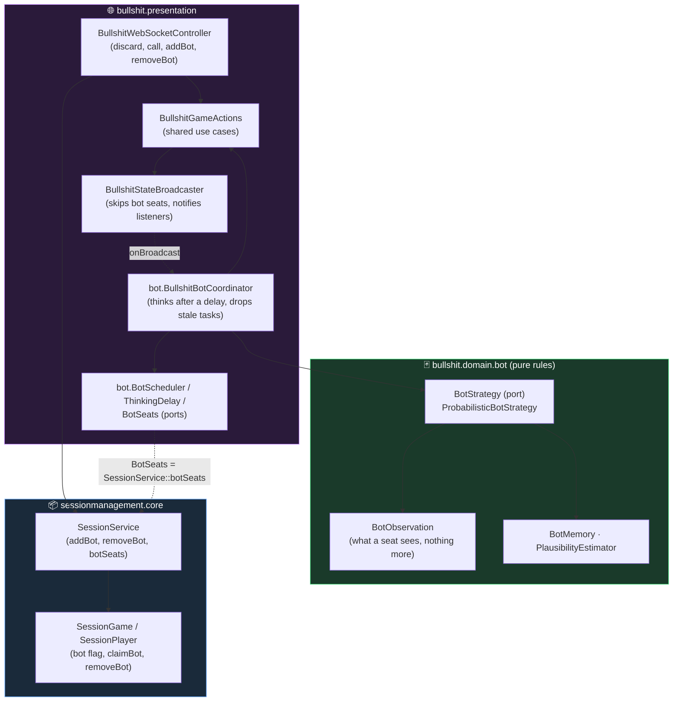

# Backend Context Map

Two bounded contexts, one presentation layer.

```mermaid
graph TB
    subgraph Websocket["🌐 websocket (presentation / driving adapter)"]
        WS["WebSocketController"]
        REST["GameRestController"]
        WS & REST -->|calls| SS
    end

    subgraph SessionMgmt["📦 Bounded Context: Session Management (downstream)"]
        SS["SessionService"]
        PORT["SessionRepository (port)"]
        SG["SessionGame"]
        ST["SessionToken"]
        REPO["InMemorySessionRepository"]
        SS --> PORT & SG
        SG --> ST
        PORT -.->|implements| REPO
    end

    subgraph Core["♟️ Bounded Context: BatailleCorse / Game Rules (upstream)"]
        BC["BatailleCorse (aggregate root)"]
    end

    subgraph Bullshit["🃏 Bounded Context: Bullshit / Game Rules (upstream — Slice 1)"]
        BS["Bullshit (aggregate root) · ClaimMode"]
    end

    SS -->|creates / loads| BC
    SG -->|references (conformist)| BC
    SS -. "not wired yet (Slice 2)" .-> BS

    style Core fill:#1a3a2a,stroke:#4ade80,color:#fff
    style Bullshit fill:#1a3a2a,stroke:#4ade80,color:#fff
    style SessionMgmt fill:#1a2a3a,stroke:#60a5fa,color:#fff
    style Websocket fill:#2a1a3a,stroke:#c084fc,color:#fff
```

## Bounded Contexts

**BatailleCorse (Core)** — upstream, pure game rules. `BatailleCorse` is the aggregate root. No knowledge of sessions, tokens, or transport.

**Bullshit** — a second upstream game-rules context (`org.kevinkib.cardgames.bullshit.domain`), sibling to BatailleCorse, depending only on `frenchcards`. `Bullshit` is the aggregate root; the claim/match mechanic sits behind a pluggable `ClaimMode` strategy (ascending-rank today; a suit variant later). As of Slice 1 it has **no** session, presentation, or transport wiring — that is Slice 2 (generalizing Session Management over a `Game` abstraction).

**Session Management** — downstream, conforms to Core's model. Two responsibilities:
- *Room lifecycle* — `SessionGame` ties a game ID to a set of player seats
- *Player identity* — `SessionToken` maps each player seat to a secret token, used to authenticate actions

`SessionRepository` is a port (interface); `InMemorySessionRepository` is the current adapter.

**websocket** — driving adapter. No domain logic; orchestrates the two BCs and handles serialization. Named `websocket` for now but may be split or renamed as more transports are added.

## Bullshit bot players

Spec: `docs/specs/2026-10-10-bullshit-bots-design.md`. A bot is a flagged seat of the game-agnostic session core; how it plays lives in the Bullshit context behind a port, and the glue that knows both sits in the Bullshit presentation layer, like the WebSocket controller.



- **Session core**: a bot seat counts as joined, has no presence and no forfeit timer, and its internal token never resolves (`findPlayerByToken`, `findTokenByPlayer`) nor appears in a lobby view. Only the host adds or removes bots, before the game starts; a bot can be removed only where no human sits after it (`LobbyView.removableBotSeats`), so the dealt seats stay contiguous. A rematch reopens an empty lobby: bots are re-added by the host.
- **Bullshit domain**: the strategy only ever receives a `BotObservation`, built to carry exactly what `BullshitDto.forViewer` shows (a parity test and a structural test enforce it). `Bullshit.version()` lets asynchronous bot tasks detect that the table moved on.
- **Dependencies**: `sessionmanagement` never learns a game; the coordinator reaches the session core only through the `BotSeats` port (`SessionService::botSeats`) and the eviction listener.

## Relationship

Session Management has a **Conformist** relationship to Core: it speaks Core's language (`BatailleCorseId`, `PlayerId`) without translation. Core has no dependency on Session Management.
