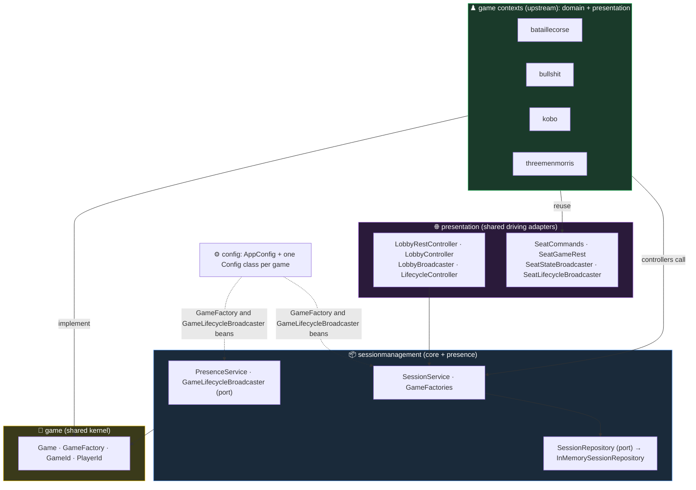
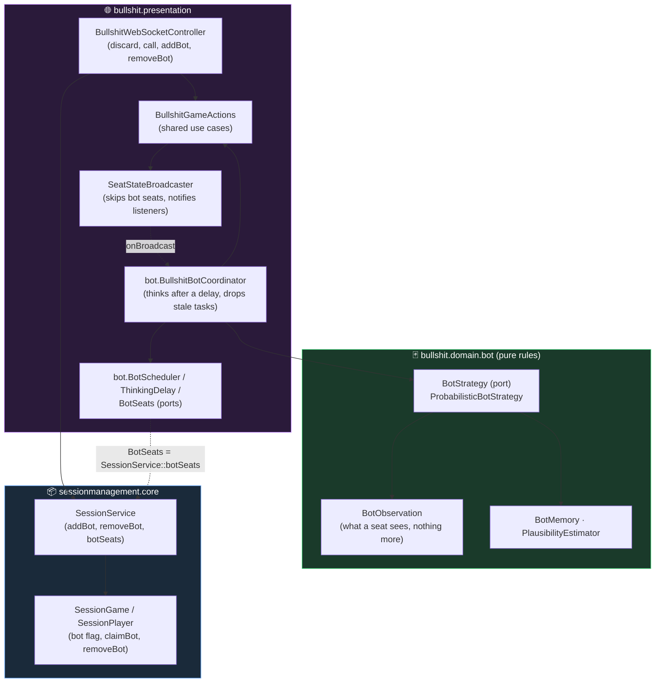
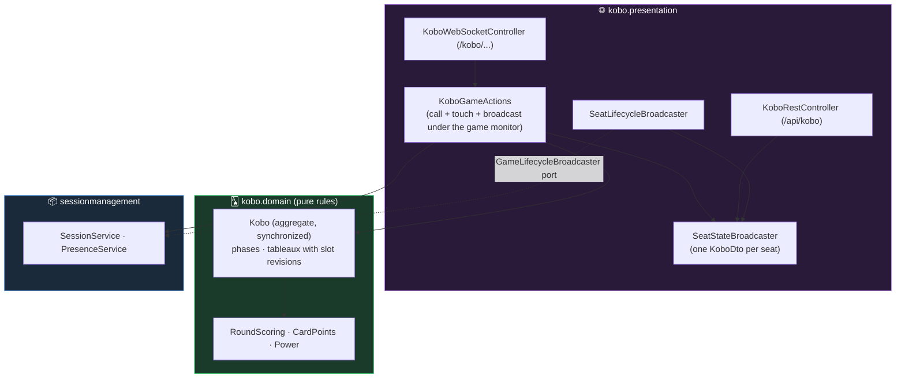

# Backend Context Map

Four game contexts, a session context, a shared kernel and a shared presentation layer, under
`backend/src/main/java/org/kevinkib/cardgames/`. Naming rules: `game-conventions.md`; how to add a game:
`add-a-game.md`.

| Package | Role |
|---------|------|
| `game` | Shared kernel: `Game`, `GameFactory`, `GameId`, `PlayerId`, `GameOptions`, `OptionDescriptor`. Knows no concrete game. |
| `sessionmanagement` | `core` (seats, tokens, create / join / start / play again, bots as flagged seats) and `presence` (connection, grace period, forfeit). Depends only on `game`. |
| `bataillecorse`, `bullshit`, `kobo`, `threemenmorris` | One bounded context per game: `domain` (pure rules) and `presentation` (controllers, use cases, DTOs, bots). No game knows another. |
| `presentation` | Shared driving adapters: lobby, presence, session REST, WebSocket configuration, `SeatCommands`, `SeatGameRest`, the seat broadcasters, bot ports. Knows no concrete game. |
| `config` | `AppConfig` (shared beans) and one `<Game>Config` per game. |

```mermaid
graph TB
    subgraph Pres["🌐 presentation (shared driving adapters)"]
        LOBBY["LobbyRestController · LobbyController<br/>LobbyBroadcaster · LifecycleController"]
        SEAT["SeatCommands · SeatGameRest<br/>SeatStateBroadcaster · SeatLifecycleBroadcaster"]
    end

    subgraph Games["♟️ game contexts (upstream): domain + presentation"]
        BC["bataillecorse"]
        BS["bullshit"]
        KO["kobo"]
        TM["threemenmorris"]
    end

    subgraph SessionMgmt["📦 sessionmanagement (core + presence)"]
        SS["SessionService · GameFactories"]
        PS["PresenceService · GameLifecycleBroadcaster (port)"]
        REPO["SessionRepository (port) → InMemorySessionRepository"]
        SS --> REPO
    end

    subgraph Kernel["🔩 game (shared kernel)"]
        K["Game · GameFactory · GameId · PlayerId"]
    end

    CFG["⚙️ config: AppConfig + one Config class per game"]

    LOBBY --> SS
    Games -->|controllers call| SS
    Games -->|reuse| SEAT
    Games -->|implement| K
    SessionMgmt --> K
    CFG -. "GameFactory and GameLifecycleBroadcaster beans" .-> SS & PS

    style Games fill:#1a3a2a,stroke:#4ade80,color:#fff
    style SessionMgmt fill:#1a2a3a,stroke:#60a5fa,color:#fff
    style Pres fill:#2a1a3a,stroke:#c084fc,color:#fff
    style Kernel fill:#3a3a1a,stroke:#facc15,color:#fff
```

The ArchUnit test `ArchitectureTest` locks these arrows; see "Shared backend building blocks".

## Bounded Contexts

**BatailleCorse** — upstream, pure game rules. `BatailleCorse` is the aggregate root, `BatailleCorseFactory` its factory (type `bataille-corse`). No knowledge of sessions, tokens, or transport. It is the legacy outlier: its REST base (`/api/game/{id}`) and commands (`/app/send`, `/app/slap`, `/app/grab`) carry no game segment, and it keeps its own `BatailleCorseStateBroadcaster` (one public state for the room) and `BatailleCorseLifecycleBroadcaster` instead of the seat broadcasters; its controllers do use `SeatCommands` and `SeatGameRest`.

**BatailleCorse computer seats** — a room seat held by a bot is played by the server. The pure part lives in `bataillecorse/domain/bot` (`BatailleCorseBotTier`: the nine tiers of the former local AI; `BatailleCorseBotStrategy`: slap, send or nothing, read from the rules in force). `BatailleCorseBotCoordinator` (`presentation/bot`) listens to the `BatailleCorseStateBroadcaster`, schedules the bot after its tier reaction time (seat option `tier`, 0 to 8, default 1, plus `bataillecorse.bots.extra-delay-ms`), re-checks `BatailleCorse.version()` under the game monitor before acting, and collects a won pile for the bot after 1500 ms (`autoGrabPlayer()`). It uses the same `BatailleCorseGameActions` as a human, starts on START, stops on game end, forfeit or eviction, and restarts on the next START after Play again. `bataillecorse.bots.enabled=false` switches it off.

**Bullshit** — upstream game rules (`org.kevinkib.cardgames.bullshit`), depending only on the `game` kernel and `frenchcards`. `Bullshit` is the aggregate root; the claim/match mechanic sits behind a pluggable `ClaimMode` strategy (ascending-rank over the deck in play, or a suit variant that draws a random starting suit each round through an injected `RandomGenerator`); the deck (`DeckSize`: 32 cards from 7 to Ace, or 52) is a creation option. Played through `BullshitWebSocketController` (`/app/bullshit/start`, then the unprefixed legacy commands `/app/discard` and `/app/callBullshit`) and `BullshitRestController` (`/api/bullshit`), with bots (next section).

**Session Management** — downstream of the kernel only: it never learns a concrete game. Two sub-contexts:
- *core* — `SessionService` creates rooms through `GameFactories` (built from every `GameFactory` bean), and `SessionGame` ties a game ID to its seats (`SessionPlayer`, humans or bots); `SessionToken` maps each seat to a secret token that authenticates actions. `SessionRepository` is a port, `InMemorySessionRepository` the adapter.
- *presence* — `PresenceService` tracks connections, the grace period and forfeits, and reaches each game through the `GameLifecycleBroadcaster` port (one bean per game, collected by `GameLifecycleBroadcasters`).

**presentation** — the shared driving adapters (lobby, presence, session REST, WebSocket configuration, `SeatCommands`, `SeatGameRest`, the seat broadcasters, bot ports). No domain logic and no concrete game; each game adds its own controllers in `<game>.presentation`.

## Bullshit bot players

Spec: `docs/specs/2026-10-10-bullshit-bots-design.md`. A bot is a flagged seat of the game-agnostic session core; how it plays lives in the Bullshit context behind a port, and the glue that knows both sits in the Bullshit presentation layer, like the WebSocket controller.

```mermaid
graph TB
    subgraph Pres["🌐 bullshit.presentation"]
        CTRL["BullshitWebSocketController<br/>(discard, call, addBot, removeBot)"]
        ACT["BullshitGameActions<br/>(shared use cases)"]
        BCAST["SeatStateBroadcaster<Bullshit, BullshitDto><br/>(skips bot seats, notifies listeners)"]
        COORD["bot.BullshitBotCoordinator<br/>(thinks after a delay, drops stale tasks)"]
        SCHED["bot.BotScheduler / ThinkingDelay /<br/>BotSeats (ports)"]
        CTRL & COORD --> ACT --> BCAST
        BCAST -. "onBroadcast" .-> COORD
        COORD --> SCHED
    end

    subgraph BS["🃏 bullshit.domain.bot (pure rules)"]
        STRAT["BotStrategy (port)<br/>ProbabilisticBotStrategy"]
        OBS["BotObservation<br/>(what a seat sees, nothing more)"]
        MEM["BotMemory · PlausibilityEstimator"]
        STRAT --> OBS & MEM
    end

    subgraph Sess["📦 sessionmanagement.core"]
        SG2["SessionGame / SessionPlayer<br/>(bot flag, claimBot, removeBot)"]
        SS2["SessionService<br/>(addBot, removeBot, botSeats)"]
        SS2 --> SG2
    end

    COORD --> STRAT
    CTRL --> SS2
    SCHED -. "BotSeats = SessionService::botSeats" .-> SS2

    style Pres fill:#2a1a3a,stroke:#c084fc,color:#fff
    style BS fill:#1a3a2a,stroke:#4ade80,color:#fff
    style Sess fill:#1a2a3a,stroke:#60a5fa,color:#fff
```

- **Session core**: a bot seat counts as joined, has no presence and no forfeit timer, and its internal token never resolves (`findPlayerByToken`, `findTokenByPlayer`) nor appears in a lobby view. Only the host adds or removes bots, before the game starts, and only for a game whose factory `supportsBots()`; a bot can be removed only where no human sits after it (`LobbyView.removableBotSeats`), so the dealt seats stay contiguous. Play again reopens the lobby with the former bots re-seated in order right after seat 0, with their names and seat options; humans come back one by one, the first caller is the host, and each human who comes back sits right after the humans already back, the bots shifting up one seat (`SessionGame.claimSeatAheadOfBots`), so the host can still remove every bot. A stranger joining through the link still takes the lowest free seat.
- **Bullshit domain**: the strategy only ever receives a `BotObservation`, built to carry exactly what `BullshitDto.forViewer` shows (a parity test and a structural test enforce it). `Bullshit.version()` lets asynchronous bot tasks detect that the table moved on.
- **Dependencies**: `sessionmanagement` never learns a game; the coordinator reaches the session core only through the `BotSeats` port (`SessionService::botSeats`) and the eviction listener.

## Kobo

Spec: `docs/specs/2026-10-11-kobo-backend-design.md`. A third upstream game-rules context (`org.kevinkib.cardgames.kobo`), plugged into the session core through a `KoboFactory` collected by `GameFactories`; nothing changes in `sessionmanagement`.

**Fixed deal for e2e** — the deal comes from the `DeckSource` port of `kobo/domain` (`RandomDeckSource` by default). Under the Spring `test` profile only, `ScriptedDeckSource` and `KoboTestDealController` (`PUT`/`DELETE /api/test/kobo/{gameId}/deal`, `{"round":1,"cards":["KH","10S",...]}` in deal order, seat 0 first) let a test choose the leading cards of a round before `start`; the route does not exist in any other profile. This is the model for any random game (`add-a-game.md`, Determinism).

```mermaid
graph TB
    subgraph KP["🌐 kobo.presentation"]
        KWS["KoboWebSocketController (/kobo/...)"]
        KREST["KoboRestController (/api/kobo)"]
        KACT["KoboGameActions<br/>(call + touch + broadcast under the game monitor)"]
        KBC["SeatStateBroadcaster<Kobo, KoboDto><br/>(one KoboDto per seat)"]
        KLC["SeatLifecycleBroadcaster<Kobo>"]
        KWS --> KACT --> KBC
        KREST --> KBC
        KLC --> KBC
    end

    subgraph KD["🂡 kobo.domain (pure rules)"]
        KOBO["Kobo (aggregate, synchronized)<br/>phases · tableaux with slot revisions"]
        SCORE["RoundScoring · CardPoints · Power"]
        KOBO --> SCORE
    end

    subgraph SM["📦 sessionmanagement"]
        SS3["SessionService · PresenceService"]
    end

    KACT --> KOBO
    KACT --> SS3
    KLC -. "GameLifecycleBroadcaster port" .-> SS3

    style KP fill:#2a1a3a,stroke:#c084fc,color:#fff
    style KD fill:#1a3a2a,stroke:#4ade80,color:#fff
    style SM fill:#1a2a3a,stroke:#60a5fa,color:#fff
```

- **Slots and revisions**: every command addresses a card as `SlotRef(seat, slot)`; each slot has a `revision` bumped when its card changes. The server never learns what a player remembers; clients drop what they knew of a slot whose revision moved.
- **The race**: any player may try to discard a card (own or another's) that matches the rank on top of the discard pile. Commands go through the `synchronized` aggregate, so the first message processed wins. A losing attempt (slot already emptied or refilled, or the pile moved) is rejected without penalty (`expectedTopRank`, `expectedRevision`); only a real rank error costs a penalty card.
- **Privacy**: `KoboDto.forViewer` is the only projection. Face-down values appear only in the viewer own DTO (starting cards before the first draw, the drawn card while deciding, the last peek) and in everyone's DTO once the round is revealed.
- **Frontend**: registered in the game selection, with its lobby and game screen (`KoboSession`, `Kobo.store`, `view/kobo/KoboGameScreen.vue`); the table itself is in progress (issue #149). Bots: see "Kobo bots" below.

### Kobo bots

Spec: `docs/specs/2026-10-14-kobo-bot-design.md`. `KoboFactory.supportsBots()` is true and declares the seat option `level` = `easy|medium|hard` (default `medium`, label `options.kobo.level`). The strategy side is pure, in `kobo.domain.bot` (B1): `KoboBotView.forSeat(game, seat)` (what a human at that seat sees, in domain types; a presentation test, `KoboBotViewParityTest`, pins that it equals that seat's `KoboDto`), `KoboBotMemory` (per seat, `(slot, revision) -> card`, never wrong, only incomplete), `KoboBotStrategy` (`decide`, `matchFor`), `HeuristicKoboBot` and `KoboBotLevel` / `KoboBotTuning` (the level only picks the constants).

`kobo.presentation.bot.KoboBotCoordinator` (a `GameStateListener` and a `GameEvictionListener`, like the Morris one) owns, per game, one memory per bot seat and two kinds of tasks, all handled under the game monitor:
- **Memory feed**, on every state change and in this order: the public moves of the broadcast's `KoboEventData` (`BLIND_SWAP` and `KING_SWAP` call `onSwapped`, a successful `MATCH` with a gift calls `onMoved`, the bot's own `SWAP` calls `onOwnDrawnPlaced`, its own `END_TURN` or `KOBO` makes it forget), then `observe(view)`.
- **Turn tasks** (a barrier to ready, the seat's turn step, or the gift), after the `ThinkingDelay` (`kobo.bots.delay-min-ms` / `delay-max-ms`, 600 to 1200 ms per step); keyed on the game version and dropped if the state moved. A strategy failure or a refused decision falls back to one fixed legal action per phase (`READY`, `DRAW`, `DISCARD_DRAWN`, `SKIP_POWER`, `END_TURN`, `GIVE_TEN`); a King swap refused because the peeked card moved (`StaleSlotException`, `EmptySlotException`) falls back to `SKIP_POWER`.
- **Match tasks** (the race), keyed on the discard top and not on the version: a bot that remembers a card of the top's rank reacts after the `ReactionDelay` of its level (`UniformReactionDelay`, the tuning's bounds times `kobo.bots.reaction-scale`); an unrelated action (a draw, a failed match) does not restart it, only a new top cancels it. At firing it re-checks the top and that its memory still holds the card at the same revision; a refusal by the game is a lost race, ignored without fallback or penalty.
- A table is dropped when the game finishes, is evicted, is reopened under the same id (Play again, fresh memories), or has no human left.

`KoboConfig` gives the broadcaster `sessionService::botSeats` (a bot seat gets no message; `KoboDto.PlayerDto.bot` is true for bot seats and omitted from the JSON otherwise), the `koboBotRandom` generator (`ThreadLocalRandomGenerator`; a fixed-seed `Random` under the `test` profile, not a constant, so a medium bot's forgetting still varies) and registers the coordinator. Under the `test` profile both delays and the reaction scale are 0.

## Three Men's Morris

Spec: `docs/specs/2026-10-11-three-men-morris-backend-design.md`. A fourth upstream game-rules context (`org.kevinkib.cardgames.threemenmorris`), two players, plugged into the session core through a `ThreeMenMorrisFactory` (type `three-men-morris`, lobby option `variant` = `tapatan|achi|six`, default `tapatan`; Picaria removed 2026-10-18, see `docs/specs/2026-10-18-six-men-morris-design.md`; lobby option `hostColour` = `white|black|random`, default `random`) collected by `GameFactories`; nothing changes in `sessionmanagement`. `ThreeMenMorrisWebSocketController` (`/app/three-men-morris/start|place|move|remove|offerDraw|acceptDraw|declineDraw`, over `SeatCommands`) and `ThreeMenMorrisRestController` (`/api/three-men-morris`, over `SeatGameRest`) authenticate by seat token and delegate to `ThreeMenMorrisGameActions` (call, touch, one broadcast of a `ThreeMenMorrisDto` per seat through a `SeatStateBroadcaster<ThreeMenMorris, ThreeMenMorrisDto>`); a `SeatLifecycleBroadcaster<ThreeMenMorris>` serves presence and forfeit. Both are beans of `config/ThreeMenMorrisConfig.java`. The rules (board, placement, movement, lines, mills and removal, blocked player) live in the `ThreeMenMorris` aggregate. The variants are data, not classes: `MorrisVariant` maps an option key to a `MorrisRules` (a `Geometry` of points, adjacency and lines, pieces per player, a `LineRule` `WIN|MILL`, a `RemovalRule`, a `FlyingRule` and the quiet-ply limit): Tapatan (3 pieces) and Achi (4 pieces, one hole) on the 3x3 grid, where a line wins; Six Men's Morris (6 pieces, 16 points on two squares, no diagonals) where a line is a mill. A mill opens a pending removal that only the mill's owner may close (`remove`): a piece in a mill is protected unless every opponent piece is in one; a player left with two pieces loses (`REDUCED`), a blocked player loses, and 50 quiet plies are a draw (`DRAW_MOVE_LIMIT`). The DTO adds `variant` and `legalPlacements` for Achi and Six, and for the mill variants `removal`, `legalRemovals`, per-player `lost` and the quiet-ply count, so the Tapatan wire is byte-identical to v1. Frontend: registered and playable (`docs/specs/2026-10-13-three-men-morris-frontend-design.md`). Bots: see "Three Men's Morris bots" below (v2: `docs/specs/2026-10-14-three-men-morris-v2-design.md`, issue #147).

### Three Men's Morris bots

Same pattern as the Bullshit bots, with levels as a seat option. `ThreeMenMorrisFactory.supportsBots()` is true and declares the seat option `level` = `random|greedy|perfect` (default `greedy`, label `options.threeMenMorris.level`). In `threemenmorris.domain.bot` (pure): `MorrisBot` (port: `decide(position, seat, drawOfferPending)` returns a `MorrisDecision`: `Place`, `Step`, `Remove`, `AcceptDraw`, `DeclineDraw`), `RandomBot`, `GreedyBot` (takes a line or closes a mill, else blocks the opponent's next one; after a mill it takes the piece that leaves the opponent no reply), `PerfectBot` (reads the solver on Tapatan and Achi), `SearchBot` (Expert on Six, where no table fits: a depth-3 negamax with alpha-beta and a node cap, used by `PerfectBot` when the rules are not `solvable()`), `MorrisBotLevel` (option value to strategy), `MorrisTransitions` (the rules as a pure function of a `MorrisPosition`, checked against the aggregate by random games) and `MorrisSolver` (retrograde analysis per `WIN` rules: win, loss or draw with a depth for every reachable position, cached per rules, a few milliseconds). Every level answers a draw offer with one rule: accept when the solver says the position is a draw or a loss for the bot, decline when it is a win (on Six, with no table: accept unless the bot is ahead in pieces left); bots never offer a draw. In `threemenmorris.presentation.bot`: `MorrisBotCoordinator` (a `GameStateListener` and a `GameEvictionListener`): after each broadcast it schedules one task per bot seat that must answer an offer or play, after the `ThinkingDelay` (`threemenmorris.bots.delay-min-ms` / `delay-max-ms`, 700 to 1300 ms, 0 under the `test` profile); the decision is computed outside the game monitor (snapshot under the monitor, version re-checked after the search, stale answers dropped, like the Mangola coordinator), and the removal owed after a mill is a decision like any other; the task acts through `ThreeMenMorrisGameActions`; a failing strategy falls back to the first legal action. `ThreeMenMorrisConfig` gives the broadcaster `sessionService::botSeats` (a bot seat gets no message) and registers the coordinator. Under the `test` profile the Morris generator is constant, so `greedy` and `perfect` are deterministic.

## President

Spec: `docs/specs/2026-10-15-president-design.md`, plan: `docs/plans/2026-10-15-president-plan.md`. An upstream game-rules context (`org.kevinkib.cardgames.president`), 3 to 8 players, plugged into the session core through a `PresidentFactory` (type `president`, computer seats with a `level`) collected by `GameFactories`; nothing changes in `sessionmanagement`. Lobby options (strict parse, unknown keys refused): `afterPass`, `firstLead` (default `kingOfHearts`), `exchange`, `giveBack`, `nextLead`, `scoring`, `length` (`rounds-5` by default, `endless` never ends). `equalPlay` (V1) and the V2 trick options are declared to the lobby: `forbiddenFinish` (`lastPlace|off`, default `lastPlace`) and `mustPlay` (`off|on`); the other variant options (runs, revolution, ...) exist in `PresidentOptions` as off values but are not declared until their PRs. `PresidentWebSocketController` (`/app/president/start|play|pass|giveBack|ready|seeExchange`, over `SeatCommands`) and `PresidentRestController` (`/api/president`, over `SeatGameRest`) authenticate by seat token and delegate to `PresidentGameActions` (call, touch, one broadcast of a `PresidentDto` per seat through a `SeatStateBroadcaster<President, PresidentDto>`); a `SeatLifecycleBroadcaster<President>` serves presence and forfeit. All are beans of `config/PresidentConfig.java`. The DTO carries the viewer's own hand, exchange cards and legal plays only; other hands, and the cards of another pair's exchange, appear nowhere. The first player out closes the trick (`TrickEndReason.FIRST_OUT`). Deal seam: `DeckSource` is a `RandomDeckSource` in production; under the `test` profile it is a `ScriptedDeckSource` driven by `PresidentTestDealController` (`PUT|DELETE /api/test/president/{gameId}/deal`), not mapped in any other profile. Frontend: entry PR F2 (registry, lobby with the Classic card and Customise through the shared options slot, table, minimal exchange and round-over placeholders). Bot strategy (`president/domain/bot`, pure; wired to the table by B2, see "President bots"): `PresidentBotView.forSeat(game, seat)` (own hand, other hands as sizes, public trick, legal plays), `PresidentBotMemory` (cards seen played, exchange cards; emptied when a new round is dealt), `PresidentBotStrategy.decide(view, memory)` returning a sealed `PresidentBotDecision` (`Play`, `Pass`, `GiveBack`, `Ready`), `HeuristicPresidentBot` and the `easy|medium|hard` `PresidentBotLevel` (`DEFAULT = MEDIUM`) with their `PresidentBotTuning`. Candidates come from the domain's legal plays, so a rule change cannot make a bot play an illegal card. The frontend offers bots (Add bot, seat option `level`: Easy, Medium, Hard, `options.president.level`; bots are labelled "Bot N" through the shared `seatDisplayName`). Not covered yet: the variant rules (V3 and V4).

### President exchange view

Spec: `docs/specs/2026-10-19-president-exchange-sync-design.md`. After the card exchange of a round (round 2 or later, only when a pair exchanged), the aggregate enters the phase `EXCHANGE_VIEW` and the first trick waits until every active seat has acknowledged with `/app/president/seeExchange` (`{gameId, token, round}`; a late or repeated acknowledgement is a silent no-op, no event and no broadcast). The domain knows neither bots nor time: the bot coordinator acknowledges for the bots with no delay, and `president.presentation.PresidentExchangeViewTimeout` (a `GameStateListener` and a `GameEvictionListener`, on the same broadcaster, over the `BotScheduler` port) arms one task per game and round when a broadcast shows the view, and closes it after `president.exchange-view.timeout` (`PT20S`) with `PresidentGameActions.closeExchangeView`, so the late seats count as having seen it. Wire, additive: phase `EXCHANGE_VIEW`, action `SEE_EXCHANGE`, `players[].sawExchange`, event types `EXCHANGE_SEEN` and `EXCHANGE_CLOSED`.

### President bots

`PresidentFactory.supportsBots()` is true and declares the seat option `level` = `easy|medium|hard` (default `medium`, label `options.president.level`). The lobby refuses variant options, so a bot only plays the Classic rules. `PresidentDto.PlayerDto.bot` (true for a computer seat, omitted from the JSON otherwise) is the only change to the wire contract. A presentation test, `PresidentBotViewParityTest`, pins that `PresidentBotView` equals the seat's `PresidentDto` field for field in every phase.

`president.presentation.bot.PresidentBotCoordinator` (a `GameStateListener` and a `GameEvictionListener`, like the Kobo one) owns, per game, one strategy and one memory per bot seat, all handled under the game monitor:
- **Memory feed**, on every state change: the cards named by the broadcast's `PresidentEventData` first (the last play of a closed trick is already in the discard and no longer in the trick, so the seat view alone would miss it; `PresidentBotMemory.learnPlayed`), then `observe(view)`.
- **One task per bot seat that has a step**, after the `ThinkingDelay` (`president.bots.delay-min-ms` / `delay-max-ms`, 700 to 1300 ms): its turn (play or pass), the cards it owes back in the exchange, or `ready` at the barrier. A task is keyed on its step: during play the game version (any move makes the plan stale), during the exchange and at the barrier the phase and the round only, so one bot's give back or `ready` does not restart the thinking of the others. The next broadcast cancels the tasks whose step is gone; a task that fires on another state (the state moved without a broadcast) does nothing.
- **Decision and application in one go under the monitor** (the heuristic is cheap, unlike the Mangola search), so a decision is never stale. A strategy that throws, or a decision the game refuses, falls back to one fixed legal action: the lowest legal set when leading, a pass when following, the lowest cards in the exchange, `ready` at the barrier.
- A table is dropped when the match finishes, is evicted, is reopened under the same id (Play again: fresh memories, same seat and level), or has no human left among the active players (a forfeited human leaves `getPlayerIds()`).

`PresidentConfig` gives the broadcaster `sessionService::botSeats` (a bot seat gets no message), the `presidentBotRandom` generator (`ThreadLocalRandomGenerator`; a fixed-seed `Random` under the `test` profile, not a constant, so an easy bot still varies) and registers the coordinator. Under the `test` profile both delays are 0.

### President equal play and the first out-of-turn command

Equal play is a fixed rule (it was the `equalPlay` option until 2026-10-18; the king of hearts lead of round 1 and the forbidden finish are fixed the same way, and the strict parse refuses `equalPlay`, `firstLead` and `forbiddenFinish` like any unknown key). An equal set (same rank and count) is a legal answer and binds the next player (`Constraint.MATCH_OR_PASS`, repeated along the chain; the first pass ends it); the four cards of a rank played in succession close the trick (`TrickEndReason.QUAD`) and the last player leads; a quad played in a single play closes the trick the same way (`QUAD`, or `FIRST_OUT` when it takes 1st place, the next leader being the seat right after the player who still holds cards; a fixed rule, with no option). `/app/president/play` is the game's first command that a seat may send when it is **not** on turn: `Round.play` accepts it only as the completion of the open chain (`Completion`, offered by `President.completion(seat)` to the holder of the missing cards). The window opens with the second play of a chain (a lone play never opens it) and closes with the next play or the end of the trick; a later or wrong attempt raises `CompletionClosedException` (any other out-of-turn play stays `NotPlayersTurnException`), which is answered to the sender alone. Wire contract, additive: `trick.constraint|requiredRank|requiredCount|chain` (public), `completion` (the holder's DTO only, omitted otherwise), action `COMPLETE`, event `COMPLETION`. Bots read the same `completion` in their view; the coordinator schedules a completion task for a bot that is not the current seat and drops it when the game refuses it.

V2 (trick variants, #256). `PlayEffects.clearReason` (pure, `president.domain.play`) says whether a play closes the trick and why: `CUT` (n twos on n cards, any n, or n-1 twos on a pair or a triple with the option `reducedCut`; never under the equal-play binding unless 2 is the bound rank; 2s led, one to three, also close; including when it is the last play of the hand (a forbidden finish: no place, ranked last, but the 2s still close the trick, owner 2026-10-18 reversing #262); owner feedback 2026-10-18 replacing "a lone 2 always cuts") or `QUAD` (a quad played at once). The cuts are fixed rules; only `reducedCut` is an option. `BeatRule` and `LegalPlays` take the `reducedCut` flag and list the 2s that cut. Forbidden finish (a fixed rule): a last play containing the top rank takes no place (`PlayerOut(seat, 0, true)`); the player is placed last when the round ends, the later forbidden finisher lower, the seat still holding cards just above them. A forbidden finisher never closes the trick, whatever the play (a lone 2 or a quad of 2s that empties the hand is no `CUT` or `QUAD`; the trick ends by the normal passes, `ALL_PASSED`); only the player taking 1st place does (`FIRST_OUT`). `mustPlay` makes `Round.pass` raise `MustPlayException` while a legal play exists (a completion is never compulsory) and `availableActions` omits `PASS`. Wire, additive: `players[].forbiddenFinish` (out at once, `place` null until the round ends), `lastRound.players[].forbiddenFinish`, event data `outForbidden` and `trickEndReason = CUT`. The heuristic bot keeps a cutting 2 and avoids a forbidden finish; when the pass is refused it plays its weakest legal play.

## Mangola

Spec: `docs/specs/2026-10-15-mangola-design.md`, plan: `docs/plans/2026-10-15-mangola-plan.md`. A game-rules context (`org.kevinkib.cardgames.mangola`), two players, plugged into the session core through a `MangolaFactory` bean (type `mangola`, lobby option `firstPlayer` = `host|guest|random`, default `random`; label `options.mangola.firstPlayer`; there is no set-up option, the set-up is always free placement: owner decision 2026-10-15) collected by `GameFactories`; nothing changes in `sessionmanagement`. The domain (N1, N2) holds the sowing engine and the `Mangola` aggregate with its `PLACEMENT` → `PLAY` → `FINISHED` phases.

- **Endpoints**: `MangolaRestController` (`/api/mangola/game/{id}`, `/join`, `/play-again`, over `SeatGameRest`) and `MangolaWebSocketController` (`/app/mangola/start` with the game-type check, then `arrange` (`counts`: 16 integers in the order of the seat's loop), `confirmLayout`, `editLayout`, `sow` (`pit`: 0..31), over `SeatCommands`). A refused command answers the sender alone with an `ErrorResponse` carrying its own projection.
- **Broadcasters** (beans of `config/MangolaConfig`): `SeatStateBroadcaster<Mangola, MangolaDto>` (given `sessionService::botSeats`: a bot seat gets no message), `MangolaGameActions` (call, touch, one broadcast under the game monitor) and a `SeatLifecycleBroadcaster<Mangola>` for presence and forfeit. Events (`MangolaEventType`): `START`, `LAYOUT_CHANGED`, `LAYOUT_CONFIRMED`, `LAYOUT_WITHDRAWN`, `LAYOUTS_REVEALED`, `SOWN` (data: `seat`, `pit`, `trace`, `captured`), `GAME_OVER` (the command that ended the game, or a forfeit).
- **Hidden placement**: `MangolaDto.forViewer` is the only projection. During the placement a seat sees its own draft in `board` and `null` for each of the opponent's 16 pits, plus `ready` for both seats; the opponent's `seeds` is `null` too. Both halves become public when both seats are ready (the reveal, one version bump). A game that ends during the placement (forfeit) never reveals the drafts. `LAYOUT_CHANGED` carries only the seat: the shared `SeatStateBroadcaster` sends every event to every human seat, so the other seat receives the event and a state in which nothing of the draft shows (it learns that a draft changed, never what it is). `draftOnlyEndless` (viewer's own draft, placement only) warns that every move of the draft is endless when played alone.
- **DTO fields**: `started`, `id`, `gameType`, `version`, `phase`, `currentSeat`, `seatA` (the seat owning rows 1 and 2, who starts), `board` (32 pits, `row * 8 + column`), `players[]` (`seat`, `name`, `current`, `side`, `seeds`, `ready`), `legalPits` (viewer, in play), `availableActions` (`ARRANGE`, `CONFIRM_LAYOUT`, `EDIT_LAYOUT`, `SOW`), `lastMove` (`seat`, `pit`, `trace` of `PICK`, `DROP`, `SKIP_EMPTY`, `CAPTURE`, `RELAY`, `RESUME_AFTER` steps), `repetitions` (from 2), `outcome` (`ONGOING` / `FINISHED{winner, reason}`).
- **Random seam**: the `mangolaRandom` generator is a `ThreadLocalRandomGenerator` outside the `test` profile and constant (every draw 0: the host starts) under it. `firstPlayer=host` makes the starter deterministic without it; a game always starts in the placement phase, and tests that need a fixed position build it with `Mangola.fromLayout`.
- **Frontend**: entry PR N7 (registry with `supportsBots: false`, `mangola-room`, `MangolaGameScreen`: shared lobby with the two host options through the generic options mechanism, placement editor, then the board with the sowing animation and its Skip button, the end screen held until the last sowing is shown, a draw shown as `draw`).
- **Not covered yet**: the test-position seam of the end-to-end PR (the Cypress specs play from two seeds per pit instead). The frontend offers bots (Add bot, seat option `level`: Easy, Medium, Expert; the rules say Expert is strong but not perfect). Bots: see "Mangola bots" below. The architecture rules cover the package (`ArchitectureRules.GAMES`).

### Mangola bots

Same pattern as the Three Men's Morris bots (a flagged seat of the session core, the strategy in the domain behind a port, the glue in the presentation layer), with two differences that come from the game: the placement is hidden and simultaneous, and a search can take a few hundred milliseconds. `MangolaFactory.supportsBots()` is true and declares the seat option `level` = `random|greedy|expert` (default `greedy`, label `options.mangola.level`).

- **Domain (`mangola.domain.bot`, pure)**: `MangolaBot` (port: `decideLayout(rules, side, rejected)` returns 16 counts summing to 32, `decideMove(position, side)` returns a pit), `RandomMangolaBot`, `GreedyMangolaBot` (one ply: the pit that keeps the most seeds on its half, that is the biggest capture, then the most pits left to sow), `ExpertMangolaBot` (negamax with alpha-beta and iterative deepening under a time budget and a node cap, moves ordered by captures, the best move of the previous depth first; the evaluation is the seed difference, the pits that can be sown, and the captures on offer minus those exposed; a finished game is worth plus or minus a million minus the plies, a draw by an endless sowing 0), `MangolaBotLevel` (option value to strategy). It is strong but not perfect: a position is 32 pit counts, no table of solved positions exists. Every tie goes through an injected `RandomGenerator`; the first depth is always completed, so a bot always answers, whatever the budget. A bot never plays an endless sowing when the rules make it illegal (it only sees the legal moves of the domain).
- **Hidden placement**: the port has no parameter for the opponent's draft, so a bot cannot peek; it only receives the rules, its own side (side A starts) and the layouts the game already refused it. The expert and the medium bot draw their layout from the placement book of their side (`mangola/domain/bot/MangolaPlacementBook`, frozen from the placement study), weighted for the expert and uniform for the medium one. A confirmation that completes the pair and leaves the starting seat without a move is refused with `StuckStartException`: the coordinator retries with another layout (the refused ones are passed back, and the book draw skips them, then a deterministic catalogue keeps the choice varied even with a constant generator), up to 8 times, then waits; the memory of refusals is dropped as soon as the opponent takes its confirmation back.
- **Presentation (`mangola.presentation.bot`)**: `MangolaBotCoordinator` (a `GameStateListener` and a `GameEvictionListener`). After each broadcast it schedules, after the `ThinkingDelay`, one task per bot seat that must arrange and confirm (placement) or sow (its turn). Unlike Morris, **the decision is computed outside the monitor of the game**: the task takes a snapshot (position, side, level) under the monitor and drops itself if the version moved, thinks without any lock, then takes the monitor again, checks the version a second time and applies the decision through `MangolaGameActions`. A human action, a forfeit or a Leave therefore never waits for a search, and a stale answer is discarded. A failing or illegal decision falls back to the first legal pit (or two seeds per pit for a layout); nothing is scheduled once the game is over, no human is left or it was evicted, and Play again gets a fresh table.
- **Wiring (`config/MangolaConfig`)**: the broadcaster is given `sessionService::botSeats`; `mangola.bots.delay-min-ms` / `delay-max-ms` (700 to 1300 ms) and `mangola.bots.think-ms` (300, the expert's search time for a move), all 0 under the `test` profile (the expert then completes only its first depth). A safety node cap of 5 million applies in production.
- **Strength** (measured by `ExpertStrengthBenchmark`, run with `-Dmangola.bench=true -Dtest=ExpertStrengthBenchmark`): the expert reaches depth 7 to 9 in 300 ms. Against the greedy bot, each arranging its own half, it wins 98 to 99 games out of 100 (alternating who starts). On boards imposed by the random set-up the starter wins about 80 % of games between two greedy bots (games last about 11 plies), so the expert wins nearly every game it starts and about a third of those it does not.

## Draughts

Spec: `docs/specs/2026-10-28-draughts-design.md`, plan: `docs/plans/2026-10-28-draughts-plan.md`. A game-rules context (`org.kevinkib.cardgames.draughts`), international draughts on 10x10 for two players, plugged into the session core through a `DraughtsFactory` bean (type `draughts`, lobby options `hostColour` = `white|black|random` (default `random`; draw offers are always allowed, no option; a legacy `drawOffers` key is ignored), labels `options.draughts.*`; seat option `level` = `random|greedy|expert`, default `greedy`). Nothing changes in `sessionmanagement`; the public game list and the usage statistics work on the game type key and need nothing.

- **Domain (pure)**: `MoveGenerator` (legal moves with the majority rule, `apply`, `lossReason`) and `DrawTracker` (the automatic draws of article 6) are the rules; the `Draughts` aggregate only owns the seats, the turn, the draw offers, the history, the end and the version. The seat to move follows the colour to move of the position. Rejected commands are `DraughtsException`s whose message is a locale key (`draughts.errors.illegalMove`, `ambiguousMove`, `notYourTurn`, `gameFinished`, `invalidSquare`, `drawOfferPending`, `drawAlreadyOffered`, `ownDrawOffer`, `noDrawOffer`), sent as the `ErrorResponse` message and never shown as text.
- **Endpoints**: `DraughtsRestController` (`/api/draughts/game/{id}`, `/join`, `/play-again`, over `SeatGameRest`) and `DraughtsWebSocketController` (`/app/draughts/start` with the game-type check, then `move` (`from`, `to`, `captures`: the set of captured squares, which tells apart moves with the same start and end), `offerDraw`, `acceptDraw`, `declineDraw`, over `SeatCommands`). Resignation is the shared `/app/forfeit`. A move clears any pending draw offer.
- **Broadcasters** (beans of `config/DraughtsConfig`): `SeatStateBroadcaster<Draughts, DraughtsDto>` (given `sessionService::botSeats`), `DraughtsGameActions` (shared by humans and the future bots) and a `SeatLifecycleBroadcaster<Draughts>`. Events (`DraughtsEventType`): `START`, `MOVE` (data `seat`, `from`, `to`, `path`, `captures`, `promotes`), `DRAW_OFFERED` and `DRAW_DECLINED` (data `seat`), `GAME_OVER` (the command that ended the game, with the move data when it was a move).
- **DTO**: `DraughtsDto.forViewer` is the only projection; nothing is hidden, the viewer only scopes its `availableActions` (`MOVE`, `OFFER_DRAW`, `ACCEPT_DRAW`, `DECLINE_DRAW`), its `legalMoves` and the capture hint (`captureRequired`, `maxCaptures`), all empty or false outside its turn. Other fields: `board` (50 entries, index `square - 1`, `w W b B` or null), `players[]` (`seat`, `name`, `colour`, `current`, `men`, `kings`, `captured`, `bot`, `level`), `whiteSeat`, `lastMove`, `drawOffer {by}`, `drawCounters` (present only once it matters: `kingOnlyPlies` and `kingOnlyLimit` from 30 of 50, `endgame {case: SIXTEEN|FIVE, plies, limit}` as soon as a 6.3 / 6.4 material case applies, plies and limits counted in plies), `repetitions` (from 2), `history` (notation), `outcome`.
- **Random seam**: the `draughtsRandom` generator is a `ThreadLocalRandomGenerator` outside the `test` profile and constant (the host is White) under it.
- **Test-position seam** (profile `test` only): `PUT /api/test/draughts/{gameId}/position` with `{layout, toMove}` (`DraughtsTestPositionController`) replaces the position of a started game (history, counters and any offer start afresh) and broadcasts the new state to the seats under the event type `POSITION`; absent from the context and the routes otherwise (`DraughtsTestPositionAbsentInProductionIT`).
- **Not covered**: nothing in the backend; the game is on the picker since the entry PR (E).

## Ninety-Nine (99)

Spec: `docs/specs/2026-10-28-ninety-nine-design.md`, plan: `docs/plans/2026-10-28-ninety-nine-plan.md`. A game-rules context (`org.kevinkib.cardgames.ninetynine`), 2 to 12 players, plugged into the session core through a `NinetyNineFactory` bean (type `ninety-nine`, lobby options `lives` = `3|2|4` and `quick` = `off|on`, labels `options.ninetyNine.*`; seat option `level` = `easy|medium|hard`, default `medium`). Nothing changes in `sessionmanagement`; the public game list and the usage statistics work on the game type key and need nothing.

- **Endpoints**: `NinetyNineRestController` (`/api/ninety-nine/game/{id}`, `/join`, `/play-again`, over `SeatGameRest`) and `NinetyNineWebSocketController` (`/app/ninety-nine/start` with the game-type check, then `play` with `card` and `aceValue`, over `SeatCommands`). Leaving is the shared `/app/forfeit`. A refused command answers the sender alone with the domain message (the frontend shows a generic notice, never the text).
- **Broadcasters** (beans of `config/NinetyNineConfig`): `SeatStateBroadcaster<NinetyNine, NinetyNineDto>` (given `sessionService::botSeats`), `NinetyNineGameActions` (shared by humans, the bots and the round pause) and a `SeatLifecycleBroadcaster<NinetyNine>`. A command is announced by **one broadcast per domain event, in order, each carrying the state after the whole command** (`NinetyNineEventType`): `PLAY` (data `seat`, `card`, `aceValue`, `totalAfter`, `reversed`), `RESHUFFLE` (`stockSize`), `BUST` (`seat`, the stuck `hand`, `livesLeft`), `ELIMINATED` (`seat`, `place`), `GAME_OVER`, and `ROUND_START` (`seat` that starts) for the deal that follows a pause; `START` opens the game. All other fields of the data are null.
- **DTO**: `NinetyNineDto.forViewer` is the only projection. Public: `round`, `phase`, `total`, `direction`, `currentSeat`, `pileTop`, `pileCount`, `stockSize`, `options`, `players[]` (`seat`, `name`, `bot`, `level`, `lives`, `handSize`, `eliminated`, `place`), `lastPlay` (kept in the aggregate until the next deal), `lastBust` (the stuck hand is public), `outcome` (`winners`, several in quick mode, and `reason`). Viewer only: `hand`, `playable` (per card: `safe` and the Ace values allowed, computed by `CardEffect` while a round is played) and `availableActions`. No other hand and no stock order is ever sent.
- **Round pause**: `NinetyNineRoundPause` is a state listener: on `ROUND_OVER` it arms one task (`ninetynine.round-pause-ms`, 2500 ms, 0 under `test`) keyed on the game version; the task deals the next round through `NinetyNineGameActions.nextRound(id, version)`, which does nothing for a stale version. Any other phase, a new version or an eviction cancels it. No ready barrier.
- **Bots**: `NinetyNineBotView.forSeat(game, seat)` (domain, parity-tested against the seat's DTO) feeds the strategy of `NinetyNineBots.forLevel`; `NinetyNineBotCoordinator` (state listener, President/Morris pattern) schedules one task for the bot on turn after a thinking delay (`ninetynine.bots.delay-min-ms` / `delay-max-ms`, 700 to 1300 ms, 0 under `test`), decides outside the monitor, re-checks the version before playing, and falls back to the first safe card (Ace at 1) when the strategy fails or proposes a refused card. Its random source is not a bean (seeded by `ninetynine.bots.seed` under `test`).
- **Determinism seam** (profile `test` only): `ScriptedDeckSource` replaces the random deck source and `PUT /api/test/ninety-nine/{gameId}/deal` with `{round, cards, firstSeat, reshuffle}` fixes the leading cards of a round (deal order, then stock), the seat that starts round 1 and the next reshuffle; `DELETE` forgets them. Absent from the context and the routes otherwise (`NinetyNineFixedDealAbsentInProductionIT`).
- **Frontend**: the entry PR registers `ninety-nine` (picker card, `/ninety-nine/room/:id`, room client, rules and French texts) and adds the nominal Cypress spec `ninety-nine-game.cy.ts` (in the smoke subset). **Not covered yet**: nothing planned; see the plan for the open owner questions.

## Blackjack

Spec: `docs/specs/2026-10-28-blackjack-design.md`, plan: `docs/plans/2026-10-28-blackjack-plan.md`. A game-rules context (`org.kevinkib.cardgames.blackjack`), 1 to 6 players against one automated dealer (one seat is a solo game, two or more a 100-point tournament), plugged into the session core through a `BlackjackFactory` bean (type `blackjack`, lobby options `hands` = `10|5|15|20` and `maxBet` = `50|25|100`, labels `options.blackjack.*`; seat option `level` = `easy|medium|hard`, default `medium`). `minPlayers = 1` is new for the session core, which reads it from the factory. The public game list and the usage statistics need nothing.

- **Endpoints**: `BlackjackRestController` (`/api/blackjack/game/{id}`, `/join`, `/play-again`, over `SeatGameRest`) and `BlackjackWebSocketController` (`/app/blackjack/start` with the game-type check, then `bet` (`amount`), `hit`, `stand`, `double`, `split`, over `SeatCommands`). Leaving is the shared `/app/forfeit`. A refused command answers the sender alone with a `BlackjackErrorResponse`: the generic error plus an `errorCode` (`NOT_YOUR_TURN`, `WRONG_PHASE`, `ALREADY_BET`, `INVALID_BET`, `ACTION_NOT_ALLOWED`, `GAME_FINISHED`) the client words itself.
- **Broadcasters** (beans of `config/BlackjackConfig`): `SeatStateBroadcaster<Blackjack, BlackjackDto>`, `BlackjackGameActions` (shared by humans and bots) and a `BlackjackLifecycleBroadcaster` (the generic seat one plus the aftermath of a forfeit). A command is announced by **one broadcast per domain event, in order, each carrying the state after the whole command** (`BlackjackEventType`): `BET`, `DEAL`, `DEALER_BLACKJACK`, `HIT`, `STAND`, `DOUBLE`, `SPLIT` (data `cards` = the flat cards the two hands hold right after the split, hand 0 then hand 1), `BUST`, `DEALER_PLAY`, `SETTLE`, `ELIMINATED`, `GAME_OVER`; `START` opens the game. All other fields of the data are null. No pause bean: nothing is scheduled between hands.
- **DTO**: `BlackjackDto.forViewer` is the only projection. Public: phase, hand counters, `button`, `currentSeat`, `activeHandIndex`, `options`, `dealer` (the hole card only once shown), `players[]` (stack, `betPlaced`, `bet` null for another seat while betting, hands with totals and statuses, `standing`, `place`), `lastHand` (kept during the next betting), `outcome`. Viewer only: `availableActions`, `betLimits`, `lastBet`. The shoe order is never sent.
- **Bots**: `BlackjackBotView.forSeat(game, seat)` (domain, parity-tested against the seat's DTO) feeds the strategy of `BlackjackBots.forLevel`; `BlackjackBotCoordinator` (state listener) schedules, while betting, one bet task per bot that has not bet (the bets are simultaneous, the tasks survive the other bets) and, while playing, one task for the bot on turn (`blackjack.bots.delay-min-ms` / `delay-max-ms`, 700 to 1300 ms, 0 under `test`). It decides outside the monitor, re-checks before acting and falls back to a bet of 1 or `STAND` when the strategy fails or is refused.
- **Determinism seam** (profile `test` only): `ScriptedShoeSource` replaces the random shoe source and `PUT /api/test/blackjack/{gameId}/deal` with `{hands: [[cards of hand 1], [cards of hand 2]...]}` fixes the leading cards of each hand (deal order, then draw order); `DELETE` forgets them; a rematch forgets them too. Absent from the context and the routes otherwise (`BlackjackFixedShoeAbsentInProductionIT`).
- **Frontend**: the entry PR registers `blackjack`. **Not covered yet**: the picker entry, the route and the Cypress spec (entry PR).

## Kilo de merde

Spec: `docs/specs/2026-10-28-kilo-de-merde-design.md`, plan: `docs/plans/2026-10-28-kilo-de-merde-plan.md`. A game-rules context (`org.kevinkib.cardgames.kilodemerde`), 3 to 10 players, plugged into the session core through a `KiloDeMerdeFactory` bean (type `kilo-de-merde`, host option `rounds`, computer seats with a `level`) collected by `GameFactories`; nothing changes in `sessionmanagement`. Real time: passes are simultaneous steps and the slap is a race. Domain and bot strategies: see the spec; this section is the presentation layer (chunk C3).

- **Endpoints**: `KiloDeMerdeRestController` (`/api/kilo-de-merde/game/{id}`, `/join`, `/play-again`, over `SeatGameRest`) and `KiloDeMerdeWebSocketController` (`/app/kilo-de-merde/start` with the game-type check, then `pass` with a `card` and `slap`, over `SeatCommands`). Leaving is the shared `/app/forfeit`. A refused command answers the sender alone with the domain message.
- **Broadcasters** (beans of `config/KiloDeMerdeConfig`): `SeatStateBroadcaster<KiloDeMerde, KiloDeMerdeDto>`, `KiloDeMerdeGameActions` (shared by humans, bots and the timers; one broadcast per domain event, each with the state after the whole command: PASS_CHOSEN, STEP, RACE, SLAP, FALSE_SLAP, DRAW, FLUSH, ROUND_OVER, ROUND_START, GAME_OVER) and a `KiloDeMerdeLifecycleBroadcaster` (the seat one plus the announcement of what a forfeit caused: the new deal or the end of the game).
- **DTO**: `KiloDeMerdeDto.forViewer` is the only projection. Public: `round`, `roundsTotal`, `step`, `phase`, `pileSize`, `options`, `passTimerEndsAt` / `raceEndsAt` (server epoch ms for the countdown), `players[]` (kilos, kilo cards, `chosen` mark, `slapRank`, `active`, `place`), `race`, `lastOutcome` (with every hand, only once a round is over), `result`. The viewer's own: `hand`, `myChoice`, `lastReceived`, `lastGiven`, `availableActions`. Another seat's hand, choice or received card and the order of the kilo pile appear nowhere during a round.
- **Timers** (state listeners over the `BotScheduler`, one task per wait, a different key or a new game object cancels it): `KiloDeMerdePassTimer` (`kilodemerde.pass-timer-ms`, 15000, 0 = off, off under `test`) calls `expirePassTimer`; `KiloDeMerdeRaceTimeout` (`kilodemerde.race-timeout-ms`, 5000, 3000 under `test`) calls `closeRace`; `KiloDeMerdeRoundPause` (`kilodemerde.round-pause-ms`, 3000, 0 under `test`) calls `nextRound`. They are keyed on domain counters, never on `version()` (every choice and slap bumps it): the step on a `KiloDeMerdeStepKey(round, step, seats)`, the race on `raceId()`, the pause on the round. A voided round keeps its round number and restarts at step 1, so the number of seats still playing is part of the step key. `KiloDeMerdeDeadlines` fixes the end of a step or race the first time a state or a timer asks for it, so the countdown and the timer agree.
- **Bots**: `KiloDeMerdeBotView.forSeat(game, seat)` (domain, parity-tested against the seat's DTO) feeds the strategy of `KiloDeMerdeBots.forLevel`; `KiloDeMerdeBotCoordinator` (state listener) keeps one task per wanted action and never cancels the others on a state change: a pass task per bot that has not chosen (keyed on the step), a slap task for a bot whose own hand is four of a kind (the step), a follow task per bot that has not slapped in an open race (the race). A task re-checks its key under the game monitor. A bot never false-slaps; a failing strategy or a card outside the hand falls back to `defaultPass`. Delays come from `KiloDeMerdeBotTuning` (properties `kilodemerde.bots.*`, 0 under `test`, seeded generator `kilodemerde.bots.seed`).
- **Determinism seam** (profile `test` only): `ScriptedDeckSource` replaces the random deck source and `PUT /api/test/kilo-de-merde/{gameId}/deal` with `{hands, pile}` (cards as `CardDto`) fixes the leading hands of the next deal and the kilo pile (top first; a one-card pile makes a one-round game); `DELETE` forgets them. Absent from the context and the routes otherwise (`KiloDeMerdeFixedDealAbsentInProductionIT`).
- **Frontend**: the entry PR registers `kilo-de-merde` (picker card, `/kilo-de-merde/room/:id`, room client, English and French texts) and adds the nominal Cypress spec `kilo-de-merde-game.cy.ts` (in the smoke subset). The seat keys are fixed (1 to 4 pass, Space slaps): no remappable shortcut, so no gear.
- **Not covered**: nothing in the backend or the frontend; the game is on the picker since the entry PR (I).

## Shared backend building blocks

Spec: `docs/specs/2026-10-12-backend-mutualization-design.md`. The presentation and wiring code that the games copied from one another now lives once; each game keeps its controllers (explicit mappings), its `*GameActions`, its DTO projection and its bots.

- **`SeatCommands`** (`presentation/command`, bean in `AppConfig`): authenticates a seat from the game id and token, runs the action, and answers a refused command to the sender alone with an `ErrorResponse(type, message, state)`. An unknown or malformed id, or an unknown token, is ignored (debug log). The sender's state is attached whenever a game runs. Used by the WebSocket controllers of all four games.
- **`SeatGameRest`** (`presentation/rest`): the state / join / play-again REST endpoints of a game, used by all four REST controllers.
- **`SeatStateBroadcaster<G, Dto>` and `SeatLifecycleBroadcaster<G>`** (`presentation/state`): one DTO per seat, and presence / forfeit through the `GameLifecycleBroadcaster` port; declared per game in its configuration class (Bullshit, Kobo, Three Men's Morris; Bataille Corse keeps its own pair). `LobbyBroadcaster` sends the per-viewer lobby views of every game.
- **Architecture test**: `ArchitectureTest` (test root `architecture/`, ArchUnit `archunit-junit5`, test scope, main classes only) locks five rules: `sessionmanagement` and the `game` kernel know no concrete game, presentation or config; each game's `domain` knows no Spring, session, presentation or config (one case per game); no game depends on another game; the shared `presentation` package knows no concrete game; no cycles between top-level packages. The per-game cases come from hand-written lists (`ArchitectureRules.GAMES` and two `@ValueSource` in `ArchitectureTest`): a new game must be added there, nothing fails otherwise.
- **`CardDto` and `CardLabels`** (`presentation.dto`): one null-safe card record (`rank`, `suit`, `name`) and one parser from the published rank and suit labels back to a `Card`, shared by Bataille Corse, Bullshit and Kobo.
- **One Spring configuration per game** (`config/BatailleCorseConfig`, `BullshitConfig`, `KoboConfig`, `ThreeMenMorrisConfig`): factory, broadcasters, actions and bots of that game. `AppConfig` keeps the shared beans, and `GameFactories` is built from every `GameFactory` bean.
- **`SessionService.startGame(GameId, String token, Class<T>)`** returns the typed game, so controllers no longer cast. The game-type check stays in each `start` handler, before the call (Bullshit included: "This room is not a Bullshit game").
- **`SessionToken(String)` is tolerant** (#155): a value that is not a UUID becomes a name-based (version 3) UUID that no seat holds, so a malformed token is an unknown token everywhere (REST 403, WebSocket commands ignored) instead of an exception.
- **Shared test kit** (`src/test/.../presentation/support`): `RecordingMessaging` (records seat, game and token messages), `StompTestClient` (STOMP client for the integration tests, with `Frames` that wait on received frames), `SessionTable` (in-memory repository, `SessionService` and `RecordingMessaging` over given factories).

## Public game list

Spec: `docs/specs/2026-10-26-public-game-list-design.md`. The Join page of a game lists the public games of that game type and lets a visitor join an open one from its row. It is a read model of the session core, not a game concern: no game package knows about it.

- **Visibility** (`sessionmanagement/core`): `SessionGame` holds a `LobbyVisibility` (`PUBLIC` by default, `PRIVATE`). The host sets it at creation (`privateGame` on `POST /api/lobby`, absent means public) or in the lobby (`/app/lobby/setPrivate`, host only, lobby only). It survives Play again and option changes. `LobbyView.privateGame` carries it to the lobby screens.
- **Rules** (`PublicLobbies`, a pure function): a session is listed when it is public and either started or has at least one human online. State: `OPEN` (no game, a free seat), `FULL` (no game, no free seat), `IN_PLAY` (a game exists, finished or not, until Play again or eviction). Order: open games first, newest first, then the others newest first, ties by game id. At most 50 entries (`MAX_LISTED`), with `total` and `truncated`. A started game is never joinable.
- **Snapshot and push**: `GET /api/lobbies/{gameType}` (`PublicLobbyRestController`, no token, 404 for an unknown type; the type is the server one, `bataille-corse` for Bataille Corse) and the topic `/topic/lobbies/{gameType}` (`PublicLobbyTopics`), which carries the whole `PublicLobbyListDto` `{gameType, lobbies[{gameId, gameType, hostName, joined, bots, maxPlayers, state}], total, truncated, version}`. `version` is a per-type counter, so a client drops a list older than the one it holds; after a reconnect the client fetches the snapshot again.
- **Notification**: every `SessionService` use case that changes what a list shows (create, join, play again, bots, seats, leave, rename of the host, set private, start, connection mark) reports the game type to a listener once the monitor is released (`setPublicLobbiesListener`); options and seat options do not. `PublicLobbiesEvictionNotifier` (a `GameEvictionListener`) refreshes every type when a room is evicted. `PublicLobbyBroadcaster` coalesces the notifications: at most one push per 500 ms per game type, a trailing send through the `TaskScheduler` so the last change is always published, built from the list at send time.
- **Privacy**: an entry carries only the game id, the game type, the host's display name, counts and the state. Never a token, a seat, another player's name, the options, a connection state or a timestamp. A private game is never published. Logs carry only the game type and counts. The STOMP loggers are at `INFO` in production, `DEBUG` only in the `test` profile and the dev stack. The privacy page (`PrivacyView`) describes it for visitors.
- **Frontend**: `usePublicLobbies` (snapshot, topic, version guard, reconnect refetch, batched announcements), `PublicGameList` inside `JoinGameForm`, `GameDefinition.serverType`; in the lobby, `LobbyPrivateOption`, `LobbyInvite` (chip and hint) and the Game home "Private game" checkbox.
- **Known limits**: sized for 0 to 5 real games, so there is no paging, no search, no per-IP limit on `POST /api/lobby` or on subscriptions; the cap of 50 and the 500 ms coalescing bound a payload (about 6 KB) and the push rate. The topic is open to anyone on purpose. Abandoned lobbies (no human online) are hidden and removed by the 30-minute idle sweep.

## Shared frontend card animation

Not a backend context, listed here so that a new game finds it: the pictures of a card table (flights, rings, arrows, the burst queue, the speed setting, reduced motion, texts that follow the picture) live once in `frontend/src/animation/` (`core/` pure, `dom/` measuring, `vue/` the layer and composables, one barrel), used by Kobo, President and Bullshit; Mangola uses only its speed setting; Bataille Corse and Morris keep their own (spec `docs/specs/2026-10-21-shared-card-animation-design.md`). Map: `docs/architecture/card-animation.md`; usage guide: `frontend/src/animation/README.md`. The backend is unaware of it: the picture never gates the state (Bataille Corse's `awaitAnimation` excepted).

## Relationship

`sessionmanagement` has a **Conformist** relationship to the shared kernel: it speaks the kernel's language (`Game`, `GameFactory`, `GameId`, `PlayerId`) without translation, and never a concrete game's. The game contexts implement the kernel and know nothing of sessions; their `presentation` layer is the only place where a game meets the session core.
