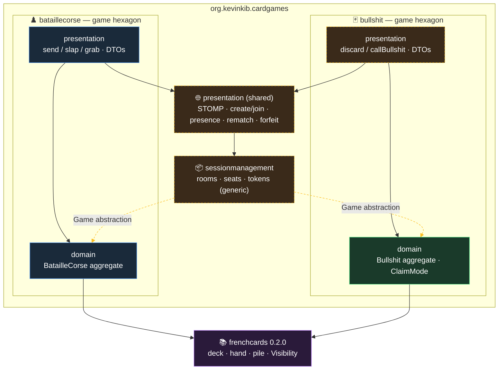

# Bullshit — Core Hexagon Design

**Date:** 2026-06-13
**Status:** Approved (design); Slice 1 ready for planning
**Scope of this spec:** Slice 1 only — the pure game-rules engine (`bullshit.domain`). Two prerequisites (Slice A: frenchcards 0.2.0 upgrade; Slice 0: restructure) and the later session/presentation/frontend slices are scoped below but not specified here.

## Goal

Add the card game **Bullshit** (a.k.a. Cheat / I Doubt It) to the project as a new game bounded context — `org.kevinkib.cardgames.bullshit.domain` — sitting beside the existing BatailleCorse hexagon. Both depend on the shared `frenchcards` library. This spec covers the pure rules engine: a self-contained, fully unit-tested aggregate with no transport, session, or UI concerns.

## Rules being modelled

- Players are dealt the whole deck. First player starts by discarding 1–4 cards face-down, claiming them as **Aces** ("one ace", "two aces", …).
- Play passes left. Each turn the claimed rank advances in consecutive ascending order: A, 2, 3, …, 10, J, Q, K, then wraps back to A and cycles indefinitely. **The claimed rank is forced by the rules — the player only chooses how many cards and which actual cards to put down.**
- A player may bluff: discard cards that do not match the claimed rank, hoping nobody calls it.
- Any other player may **call Bullshit** on the most recent discard. The questioned cards are revealed:
  - If they do **not** match the claim, the discarder (the liar) takes the entire discard pile into their hand.
  - If they **do** match, the caller takes the entire discard pile. A player may not call Bullshit on their own discard.
- **Winner:** first player to empty their hand and survive the call-Bullshit window on their final discard. Single winner; the game ends there.

## Decisions

| Decision | Choice |
|---|---|
| Player count | 2–6, N-player-aware from day one |
| Call-BS window | **Race until next discard** — after a discard, any opponent may `callBullshit` on the most recent discard, OR the next player may `discard`; first action wins (`synchronized`, like BatailleCorse `send`/`slap`). An unchallenged bluff wins. |
| Solo / AI | Out of scope. Multiplayer-only first; a bluffing AI is a separate future project. |
| Claim mechanic | Pluggable strategy (`ClaimMode`) so a future **suit-based** lying variant is a new implementation, not a rewrite. Slice 1 ships only the ascending-rank implementation. |

### Confirmed house rules

1. **After any pile is taken** (any BS resolution), the pile clears, the claim target resets to its initial value (`ACE`), and the player who *picked up the pile* starts the next round.
2. **After a successful call** (claim was truthful, caller took the pile), same as #1 — the caller starts the next round at `ACE`.
3. **Wrap-around:** claim targets cycle `A,2,…,10,J,Q,K,A,…` indefinitely; no end-of-deck reset.

## Architecture — where this lives

### Target package structure (multi-game)

The project is being restructured from a single-game root (`org.kevinkib.bataillecorse`, with `core` doubling as "the game") into a generic multi-game root where **each game is its own bounded context that owns its domain and its presentation adapter**:

```
org.kevinkib.cardgames
├── bataillecorse
│   ├── domain                ← was `core`
│   └── presentation          ← BC adapter: send/slap/grab routing, BC DTOs, BC events
├── bullshit
│   ├── domain                ← Slice 1 (this spec)
│   └── presentation          ← Bullshit adapter: discard/callBullshit, BullshitDto, reveal events
├── sessionmanagement          (generic domain: rooms, seats, identity)
├── presentation               ← SHARED transport/room plumbing: STOMP config, create/join,
│                                 presence, disconnect-forfeit, rematch, Response envelope, SessionViewDto
└── config
```

The Java root package rename is independent of the Maven `artifactId` (`bataillecorse-backend`), which does **not** change.

The envisioned end-state (after all slices) — each game is a hexagon owning its `domain` + `presentation`, both reusing `frenchcards`; a generic `sessionmanagement` and a shared `presentation` serve every game:



**Legend:** green = Slice 1 (this spec, `bullshit.domain`); blue = existing BatailleCorse code (moved in Slice 0); amber/dashed = later work — the shared `presentation` split and the generic `Game` abstraction that lets `sessionmanagement` drive any game (Slice 2), plus `bullshit.presentation`. The dashed `sessionmanagement → domain` edges are the conformist link extracted as a `Game` interface in Slice 2; today `sessionmanagement` references `BatailleCorse` directly.

### Full-feature decomposition (context for later slices)

| Slice | Scope | Status |
|---|---|---|
| **A. Upgrade frenchcards 0.1.0 → 0.2.0** | Mechanical API migration on existing code (see "frenchcards 0.2.0 upgrade" below). Prerequisite because Slice 1 targets the 0.2.0 API. | Prerequisite |
| **0. Restructure** | Pure rename/move, no logic change: `core` → `bataillecorse.domain`, `websocket` → top-level `presentation` (still BatailleCorse-flavored inside — untangled in Slice 2), root → `org.kevinkib.cardgames`, fix Spring scan base. | Prerequisite to Slice 1 |
| **1. Bullshit Core hexagon** | Pure rules engine (`bullshit.domain`), fully unit-tested. New package only. | **This spec** |
| **2. Generalize Session hexagon + split presentation** | Extract a `Game` abstraction so `SessionService`/`SessionGame`/`SessionRepository` serve any game; split the top-level `presentation` into shared plumbing + `bataillecorse.presentation`; add the `bullshit.presentation` WS adapter. | Later (own spec) |
| **3. Vue frontend** | Bullshit board: hand selection, claim display, call-BS, reveal animation. | Later (own spec) |

### Presentation reuse (informs the aggregate's public surface)

Session/presentation concerns split into **game-agnostic** (reusable) and **per-game** (new for Bullshit):

- *Reusable:* create & join game, seat claiming, `SessionToken`/`SessionPlayer`, presence, disconnect-forfeit + cleanup, rematch unanimity, STOMP config, the `Response`/`Error`/`Success` envelope, `SessionViewDto`/`SeatDto`/`JoinResponseDto`.
- *Per-game (new):* the action protocol (`discard`/`callBullshit`), the game-state DTOs (a `BullshitDto` exposing own-hand, opponents' hand counts, discard-pile size, current target, last claim, current player), and event payloads (`DiscardEventData`/`CallBullshitEventData`/`RevealEventData`).

**Design principle pushed onto Slice 1:** shape the aggregate's public surface to match what session/presentation already consume from `BatailleCorse` — `getId()`, `getPlayers()`, `getCurrentPlayer()`, `getAvailableActions(player)`, `isFinished()`, `getWinner()`, plus an N-player `forfeit(playerId)`. Do **not** build the shared `Game` interface in Slice 1 (YAGNI) — but matching method shapes makes the later extraction a lift, not a rewrite.

## frenchcards 0.2.0 upgrade (Slice A)

The shared `frenchcards` library released `0.2.0`, a breaking pre-1.0 change. Slice 1 targets the 0.2.0 API, so the existing code migrates first. Verified impact is small and mechanical:

**Production (2 files, 3 lines)** — `CardState`/`CardHandState`/`CardPileState` collapsed to binary `Visibility` (`SHOWN`/`HIDDEN`):
- `BatailleCorse.java`: `new DeckCreationOptions(CardHandState.HIDDEN_IN_HAND)` → `new DeckCreationOptions(Visibility.HIDDEN)`.
- `CentralPile.java`: `pile.add(card, CardPileState.SHOWN)` → `Visibility.SHOWN`; `pile.addBelow(card, CardPileState.HIDDEN)` → `Visibility.HIDDEN`.
- No import edits needed — both files already import `org.kevinkib.cards.domain.*`.

**Test (1 file, 2 lines)** — `Card.getState()` removed (now `getVisibility()`/`isShown()`):
- `BatailleCorseTest.java`: `getPileTopCard().getState(), is(CardPileState.SHOWN)` → `getPileTopCard().isShown(), is(true)`; drop the `CardPileState` import.
- The numerous `.withState(...)` calls in tests are the *local* `CentralPileBuilder`/`CentralPileState` enum — unaffected.

**`pom.xml`:**
- Bump `frenchcards` `0.1.0` → `0.2.0`.
- Add the test-jar so `org.kevinkib.cards.testhelpers.*` resolves (they moved to a separate test-jar):
  ```xml
  <dependency>
      <groupId>org.kevinkib</groupId>
      <artifactId>frenchcards</artifactId>
      <version>0.2.0</version>
      <type>test-jar</type>
      <scope>test</scope>
  </dependency>
  ```
  JUnit/Hamcrest already arrive via `spring-boot-starter-test`. The 0.2.0 artifact is already resolved in the local Maven repo.

**Not affected:** `Pile`/`PileSubscriber` usage (`subscribe`/`onCardAdded`/`onClear` unchanged), `DistributionOptions(boolean)`, `CardBuilder`, frontend (`CardDto` exposes no card state).

**Verification gate:** full backend suite green on 0.2.0 before starting Slice 0.

## Domain model (Slice 1)

### Aggregate root: `Bullshit` (id `BullshitId`)

State:
- `players: List<Player>` — Bullshit-local `Player(PlayerId, Hand)`, mirroring the existing one; reuses `frenchcards` `Hand`.
- `discardPile: DiscardPile` — flat face-down stack of the actual cards played; this is what a BS call hands to someone.
- `claimMode: ClaimMode` — injected strategy (default `AscendingRankClaimMode`), like `slapRules`/`penality` are injected into `BatailleCorse`.
- `currentTarget: ClaimTarget` — the value the current player must claim; produced and advanced by `claimMode`.
- `lastDiscard: Discard?` — `{ claimant: PlayerId, claimedTarget: ClaimTarget, actualCards: List<Card> }`. The only discard BS can be called on (most-recent-only). Null right after a pile is taken.
- `currentPlayerIndex` + an `IndexHandler`-style rotation.
- `pendingWinner: PlayerId?` — set when a player empties their hand; promoted to actual winner only when the call-BS window closes in their favour.
- `result: Result` — winner once decided.

### Strategy seam: `ClaimMode` / `ClaimTarget`

- `ClaimTarget` — value type wrapping the claim (rank mode: a `Rank`).
- `ClaimMode` interface:
  - `ClaimTarget initial()` — first/reset target (rank mode: `ACE`).
  - `ClaimTarget next(ClaimTarget current)` — progression (rank mode: ascending, wrap `K→A`).
  - `boolean matches(List<Card> cards, ClaimTarget target)` — truth check (rank mode: every card has that rank).
- `AscendingRankClaimMode implements ClaimMode` — the only implementation in Slice 1. Future `CyclingSuitClaimMode` is a new implementation injected at game creation.

### Actions (`Action.DISCARD`, `Action.CALL_BULLSHIT`)

**`discard(player, cards)`** — legal only when: it is `player`'s turn, game is live, `1 ≤ cards.size ≤ 4`, all `cards` are in `player`'s hand. The claimed target is always `currentTarget` (player chooses count + actual cards only). Effect: remove cards from hand → push onto `discardPile` as the new `lastDiscard` → `currentTarget = claimMode.next(currentTarget)` → advance turn. If the hand is now empty → `pendingWinner = player` (game not yet finished). **Decline semantics:** if a `pendingWinner` exists and the next player issues a `discard` (rather than calling BS), the `pendingWinner` wins at that moment (unchallenged bluff wins) and the incoming discard is not applied.

**`callBullshit(caller)`** — legal when: a `lastDiscard` exists, `caller != lastDiscard.claimant`, game is live. Reveal `lastDiscard.actualCards` and evaluate `claimMode.matches(actualCards, lastDiscard.claimedTarget)`:
- **Lie** (no match): `lastDiscard.claimant` takes the whole `discardPile` into hand; clear `pendingWinner` if it was the claimant. Then apply house rule #1 (pile clears, target resets to initial, claimant — the picker-upper — starts the next round).
- **Truthful** (match): `caller` takes the whole `discardPile`. If `pendingWinner == claimant`, the claimant **wins now** (truthful + empty hand → `result` = claimant). Otherwise apply house rule #2 (caller starts the next round at initial target).

### Construction / dealing (frenchcards 0.2.0)

- Deal with `CardsService().createDeck(DeckType.FRENCH, new DeckCreationOptions(Visibility.HIDDEN))` then `deck.distributeAll(nbPlayers)` — the no-options overload distributes round-robin and **allows uneven hands** (needed for 3/5/6 players), so no `UnevenNumberOfCardsPerPlayerException` handling is required.
- A constructor accepting an explicit `ClaimMode` (default `AscendingRankClaimMode`) mirrors how `slapRules`/`penality` are injected into `BatailleCorse`.
- Single 52-card deck → each `Card` is unique by rank+suit, so frenchcards' "equal by rank+suit only" limitation does not bite `Hand.play`/`possesses` here.

### Other behaviour

- **`forfeit(playerId)`** — N-player: remove the player and their hand from rotation. If exactly one player remains, that player wins. No-op if the game is already finished (mirrors `BatailleCorse.concede`'s race-safety).
- **`getAvailableActions(player)`** — returns the subset of `{DISCARD, CALL_BULLSHIT}` currently legal for `player`, computed by attempting the same guards the action methods use (mirrors `BatailleCorse.getAvailableActions`).
- **Win condition** — single winner: first to empty their hand and survive the closing of the call-BS window. Game ends; no play for 2nd/3rd place.

### Exceptions

Game-specific checked exceptions mirroring the BatailleCorse style: `NotPlayersTurnException`, `FinishedGameException`, `CardsNotInHandException`, `InvalidDiscardCountException` (not 1–4), `CannotCallBullshitException` (no `lastDiscard`, or caller is the claimant). Names to be finalised during planning.

## Testing

Per project testing rules: **no Mockito on domain classes.** Plain unit tests with Builders + Fixtures — a `BullshitBuilder`, `BullshitFixtures`, and `PlayerFixtures`/`PlayerBuilder` analog, following the existing `core/domain` test conventions (`givenX_thenY` naming). Card/Hand test data comes from the frenchcards `testhelpers` test-jar (`CardBuilder.aCard().withRank(...)`, `HandBuilder.aHand().withCards(...)`). Where a test needs a reproducible real deal, use the 0.2.0 deterministic seed: `new DeckCreationOptions(Visibility.HIDDEN, <seed>)`.

Coverage targets the rules that matter:
- Forced-ascending claim target; rank wrap-around `K→A`.
- `discard` guards: turn enforcement, 1–4 count bound, cards-in-hand.
- Truthful vs. lying BS resolution — liar takes pile / caller takes pile.
- The discard→react race (first action wins).
- Pending-winner confirmed on a next-player decline (unchallenged bluff wins).
- Win on truthful empty-hand final discard.
- `forfeit` collapsing rotation to a single winner; no-op when finished.
- `AscendingRankClaimMode` in isolation (initial/next/matches).

## Slice-1 boundary

**Prerequisite:** Slice 0 (restructure to `org.kevinkib.cardgames`) lands first, so `bullshit.domain` is created in the target structure rather than moved later.

**Delivers:** the `org.kevinkib.cardgames.bullshit.domain` package — `Bullshit`, `BullshitId`, `Player`, `DiscardPile`, `Discard`, `ClaimMode` / `ClaimTarget` / `AscendingRankClaimMode`, `Result`, `Action`, exceptions — plus the full test suite.

**Explicitly excludes:** session management, WebSocket controller/DTOs/events, frontend, AI, and the suit-based `ClaimMode` variant. Those are Slices 2–3 and future work.
