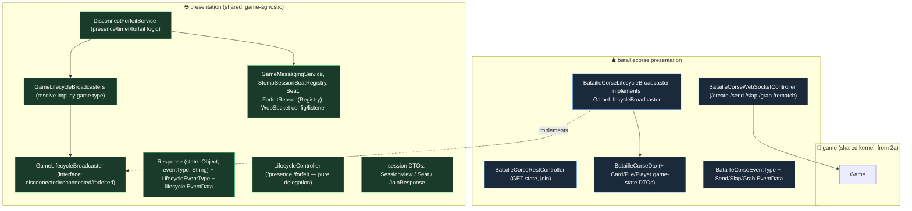

# BatailleCorse Presentation Split (Slice 2b-i) — Design

**Date:** 2026-06-14
**Status:** Approved (design); ready for planning
**Scope of this spec:** Slice 2b-i only — split the still-BatailleCorse-flavoured top-level `presentation` package into game-agnostic shared plumbing + a `bataillecorse.presentation` package. Backend only, no wire-format changes, no behaviour changes. Bullshit's migration/transport, multi-game *create* selection, and the frontend are later slices.

## Goal

After Slice 2a the session core is generic over `Game`, but presentation is not: `DisconnectForfeitService` runs a game-agnostic disconnect/forfeit/rematch lifecycle yet builds `BatailleCorseDto` directly, `Response.state` is typed `BatailleCorseDto`, and `BatailleCorseWebSocketController` mixes generic lifecycle handlers with BatailleCorse-specific actions. Slice 2b-i moves everything that knows about BatailleCorse state into `bataillecorse.presentation`, shares only what is genuinely game-agnostic, and removes the transitional `(BatailleCorse)` casts from 2a. BatailleCorse plays and serialises exactly as before.

## Guiding principle (from brainstorming)

**Seam only where all games are 100% certain to overlap; keep everything that touches game-specific state out of the seam.** Disconnect/forfeit/presence *control flow* is such a place — every game has dropped players and resignations. Rendering a game's state is **not**: BatailleCorse broadcasts one public DTO to a topic, but a hidden-information game like Bullshit needs per-viewer state (your hand is secret) delivered to user destinations. Freezing a state-rendering contract now (a `render(Game)` returning one snapshot) would bake in BatailleCorse's public-broadcast assumption and break for Bullshit. So this slice introduces **no rendering abstraction**; the single seam it adds is at the lifecycle layer and is keyed on *events (verbs)*, never on state shape.

### Rejected alternatives

- **A general `GameRenderer`/`GameStateView` seam** (an earlier draft of this spec). Rejected: it freezes a single-snapshot, audience-independent `render(Game)` contract validated against only BatailleCorse — exactly the assumption Bullshit's per-viewer state breaks. Rendering stays game-local instead.
- **Per-game `DisconnectForfeitService` (share primitives only).** Rejected in favour of one shared service: the lifecycle control flow is 100% overlap, so sharing it (with a verb-based broadcaster seam) avoids duplicating the presence/timer/forfeit orchestration per game and freezes nothing about state.

## Architecture



### 1. Shared plumbing (zero game-state knowledge)

Moves to / stays in shared `presentation`, unchanged behaviourally:
- `GameMessagingService` (sends to a game's topic by id), `StompSessionSeatRegistry`, `Seat` (`GameId` + `PlayerId`), `ForfeitReason`, `ForfeitReasonRegistry`, `WebSocketConfiguration`, `WebSocketDisconnectListener`.
- Session-level DTOs that carry no card-game knowledge: `SessionViewDto`, `SeatDto`, `JoinResponseDto`, and the player-id wrapper DTO. (The plan classifies each `dto/` file by this rule; game-state DTOs — `BatailleCorseDto`, `CardDto`, `PileDto`, `PlayerDto` — move to `bataillecorse.presentation`.)

### 2. Generic envelope & lifecycle events (shared)

- **`Response`** keeps its fields but `state` becomes `Object` (opaque — no marker, no shape contract) and `eventType` becomes a `String`. `getEventType()` already returns `String`, so wire output is identical. Each context passes its own event-type string.
- **`EventData`** interface + the lifecycle subtypes (`Forfeit`, `OpponentDisconnected`, `OpponentReconnected`, and the `Create`/`Join`/`Rematch` data if game-agnostic) stay shared. `Send`/`Slap`/`Grab` EventData move to `bataillecorse.presentation`.
- **`EventType`** is replaced by a shared **`LifecycleEventType`** (CREATE, JOIN, FORFEIT, REMATCH, OPPONENT_DISCONNECTED, OPPONENT_RECONNECTED) and a `bataillecorse.presentation` **`BatailleCorseEventType`** (SEND, SLAP, GRAB). Emitted string values match today's `EventType` exactly.

### 3. The lifecycle seam — verbs, not state

- **`DisconnectForfeitService`** (shared) keeps the genuinely common logic: presence binding/cancellation, the 60s auto-loss timer, calling `game.forfeit(seat)`, recording the forfeit reason, touching the session. It no longer builds any DTO.
- **`GameLifecycleBroadcaster`** (shared interface) — the seam, expressed as lifecycle *events*:
  ```java
  boolean supports(Game game);
  void disconnected(Game game, Seat seat, long deadlineEpochMs);
  void reconnected(Game game, Seat seat);
  void forfeited(Game game, Seat seat, ForfeitReason reason);
  ```
  The contract names *what happened*, never the shape of what is sent. Each impl owns its own rendering and delivery, so a future hidden-information game can render per-viewer to user destinations without changing this contract.
- **`GameLifecycleBroadcasters`** (shared resolver) — constructor-injected with `List<GameLifecycleBroadcaster>`; `broadcasterFor(Game)` returns the one whose `supports` is true (throws if none). One entry today.
- **`BatailleCorseLifecycleBroadcaster`** (in `bataillecorse.presentation`) — implements the interface by building the existing `BatailleCorseDto` (with forfeit reasons from `ForfeitReasonRegistry`) and sending the same `Response` to the same topic as today. Declared as a `@Bean` in `AppConfig`.

`DisconnectForfeitService` depends on `GameLifecycleBroadcasters`, not on `BatailleCorse` — so its transitional cast disappears.

### 4. Controllers

- **`LifecycleController`** (shared `@Controller`): `/presence` and `/forfeit` only — both pure delegation to `DisconnectForfeitService`, returning void, building no state.
- **`BatailleCorseWebSocketController`** (bataillecorse.presentation): `/create`, `/send`, `/slap`, `/grab`, `/rematch` — all build BatailleCorse state, so they stay game-local. (`/create` stays BatailleCorse-bound until multi-game selection in a later slice.)
- **`BatailleCorseRestController`** (bataillecorse.presentation; the current `GameRestController`): `GET /api/game/{id}` state + `POST /api/game/{id}/join` build BatailleCorse state, so they move with it. The session-view REST endpoint stays generic; if it has no game-state knowledge it may remain shared (plan decides per-endpoint).

### 5. Typed session accessor (cast removal, not a seam)

Add `<T extends Game> T getGame(GameId id, Class<T> type)` to `SessionService`: loads the game and checked-casts to `type`, throwing a clear error on mismatch (and `InvalidGameIdException` for an unknown id, as today). The existing `getGame(GameId): Game` stays for generic paths (e.g. the lifecycle service). BatailleCorse presentation calls `getGame(id, BatailleCorse.class)`. No raw `(BatailleCorse)` casts remain anywhere.

## Testing

Per project testing rules (no Mockito on domain; builders/fixtures; `givenX_whenY_thenZ`):

- **Regression:** all 189 existing tests stay green with mechanical edits only (moved types, renamed/added accessor). Emitted JSON — event strings and state fields — is unchanged.
- **`GameLifecycleBroadcasters`:** resolves `BatailleCorseLifecycleBroadcaster` for a `BatailleCorse`; throws for an unsupported game (drive with the `FakeGame` double from 2a).
- **`BatailleCorseLifecycleBroadcaster`:** `disconnected`/`reconnected`/`forfeited` send the same `Response` (event string + `BatailleCorseDto` state) the current `DisconnectForfeitService` sends today.
- **`SessionService.getGame(id, Class)`:** returns the game for the right type; throws a clear error on a type mismatch (drive with `FakeGame`).
- **Controllers:** `LifecycleControllerTest` covers presence/forfeit delegation; `BatailleCorseWebSocketControllerTest` (trimmed to create/send/slap/grab/rematch) and the BatailleCorse REST test cover the rest. Broadcasts identical to today.

## Boundary

**Delivers:** game-agnostic shared `presentation` (plumbing, generic `Response`, `LifecycleEventType` + lifecycle `EventData`, shared `DisconnectForfeitService`, the `GameLifecycleBroadcaster` verb seam + resolver, `LifecycleController`); `bataillecorse.presentation` (action controller, REST controller, BatailleCorse DTOs/EventData/`BatailleCorseEventType`, `BatailleCorseLifecycleBroadcaster`); typed `SessionService.getGame`; removal of all transitional `(BatailleCorse)` casts; the new focused tests; full suite green with unchanged wire format.

**Explicitly excludes (→ later slices):** any general game-state rendering abstraction (deliberately deferred until a second game exists); Bullshit's migration to the kernel and its broadcaster/controllers; multi-game *create* selection; the Vue frontend.
