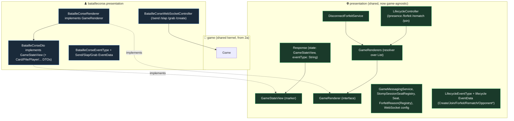

# BatailleCorse Presentation Split (Slice 2b-i) — Design

**Date:** 2026-06-14
**Status:** Approved (design); ready for planning
**Scope of this spec:** Slice 2b-i only — split the still-BatailleCorse-flavoured top-level `presentation` package into game-agnostic shared plumbing + a `bataillecorse.presentation` package, introducing a per-game **renderer** seam. Backend only, no wire-format changes, no behaviour changes. Bullshit's migration/transport, multi-game *create* selection, and the frontend are later slices.

## Goal

After Slice 2a the session core is generic over `Game`, but presentation is not: `DisconnectForfeitService` runs a game-agnostic disconnect/forfeit/rematch lifecycle yet builds `BatailleCorseDto` directly, `Response.state` is typed `BatailleCorseDto`, and `BatailleCorseWebSocketController` mixes generic lifecycle handlers with BatailleCorse-specific actions. Slice 2b-i establishes the shared/per-game seam so the lifecycle plumbing broadcasts game-specific state through an interface, and the transitional `(BatailleCorse)` casts introduced in 2a disappear. BatailleCorse plays and serialises exactly as before.

This prepares Slice 2b-ii (Bullshit onto the kernel + its renderer/action controller + multi-game create selection), where adding a game becomes "add a renderer + an action controller."

## Decisions (from brainstorming)

- **Split-first, then Bullshit.** This slice is a pure refactor with BatailleCorse as the only game; Bullshit wiring is a separate later slice. The existing 189 tests are the safety net.
- **Per-game state renderer** is the seam: shared lifecycle plumbing depends on a `GameRenderer` interface (one impl per game), not on any concrete game.
- **Extract a shared lifecycle controller**: generic message mappings (`/presence`, `/forfeit`, `/rematch`, `/join`) move to a shared `LifecycleController`; BatailleCorse keeps an action controller for `/send`, `/slap`, `/grab`, and `/create` (create stays BatailleCorse-bound until multi-game selection arrives in 2b-ii).
- **`Response.eventType` becomes a `String`** carried from per-context enums, so the shared layer stops referencing BatailleCorse action concepts. Emitted string values are unchanged.
- **No raw casts remain**: a typed `SessionService.getGame(GameId, Class<T>)` centralises the checked narrowing; the only `Game → BatailleCorse` narrowing for broadcasts lives inside `BatailleCorseRenderer`.

## Architecture



### 1. Render seam (shared)

- **`GameStateView`** — empty marker interface for a game's broadcastable state DTO. `BatailleCorseDto implements GameStateView`. `Response.state` becomes `GameStateView` (serialised JSON unchanged — same concrete `BatailleCorseDto` fields).
- **`GameRenderer`** (interface):
  ```java
  boolean supports(Game game);
  GameStateView render(Game game);
  GameStateView render(Game game, Map<PlayerId, ForfeitReason> reasonsBySeat);
  ```
  The two-arg overload covers the forfeit-broadcast path that today calls `BatailleCorseDto.from(game, reasonsBySeat)`.
- **`GameRenderers`** (resolver) — constructor-injected with `List<GameRenderer>` (Spring collects all renderer beans); `rendererFor(Game)` returns the one whose `supports` is true, throwing `IllegalStateException` if none. One entry today; Bullshit adds another bean later.

### 2. BatailleCorse renderer (bataillecorse.presentation)

- **`BatailleCorseRenderer implements GameRenderer`** — `supports` = `game instanceof BatailleCorse`; `render(...)` narrows to `BatailleCorse` and delegates to the existing `BatailleCorseDto.from(...)` factories. This is the single place the `Game → BatailleCorse` narrowing for broadcasts lives. Declared as a `@Bean` in `AppConfig` (per project bean-style: plain beans in `AppConfig`, not `@Component`).

**DTO classification principle.** A DTO stays in shared `presentation` if it describes session/lifecycle concepts with no card-game knowledge (e.g. seat/session-view, join response, the player-id wrapper); it moves to `bataillecorse.presentation` if it encodes BatailleCorse game state (the board/pile/hand DTOs). The implementation plan classifies each existing `dto/` file against this rule; the mermaid lists are illustrative, not exhaustive.

### 3. Envelope & events

- **`Response`** (shared) keeps its fields but `state: GameStateView` and `eventType: String`. Constructors take the event-type string (callers pass `LifecycleEventType.FORFEIT.toString()` etc.). `getEventType()` already returns `String`, so the wire output is identical.
- **`EventData`** interface + lifecycle subtypes (`Create/Join/Forfeit/Rematch/OpponentDisconnected/OpponentReconnected/Empty`) stay shared. `Send/Slap/Grab` EventData move to `bataillecorse.presentation`.
- **`EventType`** is replaced by two enums: shared **`LifecycleEventType`** (CREATE, JOIN, FORFEIT, REMATCH, OPPONENT_DISCONNECTED, OPPONENT_RECONNECTED) and **`BatailleCorseEventType`** (SEND, SLAP, GRAB) in `bataillecorse.presentation`. The string values match today's `EventType` exactly.

### 4. Controllers

- **`LifecycleController`** (shared `@Controller`): `/presence`, `/forfeit`, `/rematch`, `/join`. Each resolves the `Game` from the session generically and renders via `GameRenderers`. No concrete-game dependency.
- **`BatailleCorseWebSocketController`** (bataillecorse.presentation): `/send`, `/slap`, `/grab`, `/create`. Fetches the concrete game through the typed accessor and uses `BatailleCorseRenderer`/`BatailleCorseDto` for its responses.

### 5. Typed session accessor

- Add `<T extends Game> T getGame(GameId id, Class<T> type)` to `SessionService`: loads the game, checked-casts to `type`, throws a clear `IllegalStateException` (or `InvalidGameIdException` for unknown id, as today) on mismatch. The existing `getGame(GameId): Game` stays for the generic lifecycle paths. The BatailleCorse controller calls `getGame(id, BatailleCorse.class)`; `DisconnectForfeitService` stops casting and uses `GameRenderers` instead. No raw `(BatailleCorse)` casts remain in the codebase.

## Testing

Per project testing rules (no Mockito on domain; builders/fixtures; `givenX_whenY_thenZ`):

- **Regression:** all 189 existing tests stay green with only mechanical edits (moved types, renamed/added accessor). Emitted JSON — event strings and state fields — is unchanged.
- **`GameRenderers`:** resolves `BatailleCorseRenderer` for a `BatailleCorse`; throws for an unsupported game (drive with the `FakeGame` test double from 2a).
- **`BatailleCorseRenderer`:** `render(game)` and `render(game, reasons)` produce DTOs equal to the corresponding `BatailleCorseDto.from(...)` outputs.
- **`SessionService.getGame(id, Class)`:** returns the game for the right type; throws a clear error on a type mismatch (drive with `FakeGame`).
- **Controllers:** `LifecycleControllerTest` covers presence/forfeit/rematch/join broadcasts; `BatailleCorseWebSocketControllerTest` (trimmed to the action mappings) covers send/slap/grab/create. Both assert broadcasts identical to today.

## Boundary

**Delivers:** game-agnostic shared `presentation` (lifecycle controller, generic `Response`, lifecycle `EventData`, `LifecycleEventType`, render-seam types, plumbing) + `bataillecorse.presentation` (action controller, BatailleCorse DTOs/EventData/`BatailleCorseEventType`, `BatailleCorseRenderer`); typed `SessionService.getGame`; removal of all transitional `(BatailleCorse)` casts; the new focused tests; full suite green with unchanged wire format.

**Explicitly excludes (→ 2b-ii and beyond):** Bullshit's migration to the kernel (`Game`/`GameId`/factory) and its renderer + action controller; multi-game *create* selection (choosing which `GameFactory` per requested game); any Bullshit DTOs/events; the Vue frontend.
