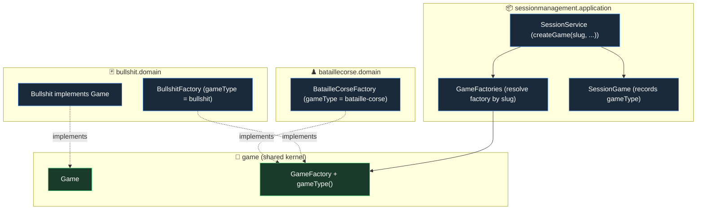

# Bullshit onto the Kernel + Multi-Game Selection (Slice 2b-ii-a) — Design

**Date:** 2026-06-14
**Status:** Approved (design); ready for planning
**Scope of this spec:** Slice 2b-ii-a only — make Bullshit a `Game` the generic session can host, and let the session create *either* game by a stable game-type id. Backend only, fully tested, nothing user-visible. Bullshit's presentation (per-viewer state, action controller, reveal events, lifecycle broadcaster) and the generic create endpoint / game-picker are **Slice 2b-ii-b / Slice 3**.

## Goal

After Slice 2b-i the session core and presentation are game-agnostic, but only BatailleCorse is wired in. Bullshit's domain is complete yet self-contained (its own `BullshitId` / `PlayerId`, not a `Game`), and `SessionService` hardwires the single `GameFactory`. This slice (1) conforms Bullshit to the shared kernel so the session can host it, and (2) generalizes game creation so the session picks a factory by a stable game-type slug. BatailleCorse plays and serializes exactly as before. This is the foundation that makes Bullshit *hostable and selectable*; rendering it is the next slice.

## Decisions (from brainstorming)

- **Split a/b, foundation first.** 2b-ii-a = kernel migration + selection (this spec); 2b-ii-b = the per-viewer Bullshit presentation (separate spec). Bullshit's hidden-information state needs per-viewer rendering delivered to per-recipient destinations — a design-heavy, security-sensitive concern kept out of this slice.
- **Slug-based factory resolver**, not a central enum: each `GameFactory` declares a stable string id; a `GameFactories` resolver maps the requested id → factory. The kernel stays game-agnostic and adding a game = register a factory bean. Mirrors the `GameLifecycleBroadcaster` resolver from 2b-i.

## Architecture



### 1. Bullshit conforms to the kernel

A near-exact replay of BatailleCorse's Slice 2a migration:

- Replace `BullshitId` with the shared `GameId`; replace `org.kevinkib.cardgames.bullshit.domain.player.PlayerId` with `org.kevinkib.cardgames.game.PlayerId`. Bullshit's `PlayerId` is byte-for-byte identical (`record PlayerId(Integer id)` with the same `toString`), so this is mechanical and behaviour-preserving. BatailleCorse's already-migrated `PlayerId`/`GameId` are unaffected (one shared kernel type for both games — this is the intended single shared id, per Slice 2a).
- `Bullshit implements Game`:
  - `getId()` returns its `GameId` (was `BullshitId`).
  - add `getPlayerIds()` = `players.stream().map(Player::id).toList()`.
  - `isFinished()` already present.
  - `forfeit(PlayerId)` **already exists** with the correct multiplayer-elimination semantics (removes the player; last one standing wins; clears pending-winner; fixes the turn index). No behaviour change — it already matches `Game.forfeit`.
- New `BullshitFactory implements GameFactory` → `new Bullshit(id, nbPlayers)` (default `AscendingRankClaimMode`). Claim-mode/suit-variant selection is a future *variant* concern, explicitly out of scope. Declared as a `@Bean` in `AppConfig`.

### 2. Slug-based game selection

- **`GameFactory`** gains `String gameType()` — a stable slug exposed as a constant on each impl: `BatailleCorseFactory.gameType()` = `"bataille-corse"`, `BullshitFactory.gameType()` = `"bullshit"`.
- **`GameFactories`** (new, `sessionmanagement.application`) — constructor-injected with `List<GameFactory>`; `factoryFor(String gameType)` returns the factory whose `gameType()` matches, throwing `IllegalArgumentException` (clear message) on an unknown slug. One bean per game registers automatically.
- **`SessionService`** is injected with `GameFactories` instead of a single `GameFactory`. `createGame` takes the slug:
  ```java
  public Game createGame(String gameType, int nbPlayers, GameMode mode, String creatorName) {
      GameId id = GameId.generate();
      Game game = factories.factoryFor(gameType).create(id, nbPlayers);
      SessionGame sessionGame = SessionGame.create(id, game.getPlayerIds(), gameType);
      // ... seat claiming unchanged ...
      repository.save(game, sessionGame);
      return game;
  }
  ```
  The convenience overloads (`createGame(int)`, `createGame(int, GameMode)`) are updated/added to default to BatailleCorse's slug where they exist purely for tests, or dropped in favour of the explicit-slug form — the plan picks the minimal set that keeps callers compiling.
- **Rematch preserves the game type.** `SessionGame` records the slug at creation (`create(GameId, List<PlayerId>, String gameType)`, exposed via `gameType()`); `rematch(id)` reads `session.gameType()` to resolve the factory: `factories.factoryFor(session.gameType()).create(id, session.seats().size())`. This is the one new field on `SessionGame`.
- **`AppConfig`**: replace the single `gameFactory()` bean with `batailleCorseFactory()` + `bullshitFactory()` + a `gameFactories()` resolver bean (over the injected `List<GameFactory>`); wire `SessionService` with `GameFactories`.
- **Presentation stays put.** The existing BatailleCorse `/create` handler passes the `"bataille-corse"` slug (a one-line change in `BatailleCorseWebSocketController`); `CreateGamePayload` is untouched. The generic create endpoint that lets a client *choose* the game is deferred to 2b-ii-b / Slice 3.

## Testing

Per project testing rules (no Mockito on domain; builders/fixtures; `givenX_whenY_thenZ`):

- **Regression:** all existing tests stay green, mechanically updated for `GameFactory.gameType()`, the `createGame(slug, …)` signature, and `SessionGame.create(…, gameType)`. BatailleCorse plays identically.
- **Bullshit conformance:** `Bullshit` viewed as `Game` exposes id / `getPlayerIds` / `isFinished`; `forfeit` through the `Game` interface eliminates a player; `BullshitFactory` creates a playable `Bullshit` with `gameType()` = `"bullshit"`.
- **Selection:** `GameFactories.factoryFor("bullshit")` and `"bataille-corse"` resolve to the right factory and an unknown slug throws; `SessionService.createGame("bullshit", …)` returns a `Bullshit`; **`rematch` preserves the game type** (a `"bullshit"` session rematches into a `Bullshit`).
- **Doubles:** the `FakeGame`/`FakeGameFactory` from Slice 2a gain a `gameType()` (a test slug) so the existing session-genericity tests keep compiling and passing.

## Boundary

**Delivers:** Bullshit conforming to the kernel (`implements Game`, `getPlayerIds`, `GameId`/`PlayerId`) + `BullshitFactory`; `GameFactory.gameType()` + the `GameFactories` resolver; `SessionService`/`SessionGame` selecting and remembering the game type; rematch type-preservation; `AppConfig` wiring for both games; full suite green plus the new conformance/selection tests.

**Explicitly excludes (→ 2b-ii-b / Slice 3):** all Bullshit presentation — per-viewer `BullshitDto`, the `/discard` + `/callBullshit` action controller, reveal events, Bullshit's `GameLifecycleBroadcaster`, and per-viewer / per-recipient delivery; the generic create endpoint and game-picker UI; claim-mode / game-variant selection; any frontend.
