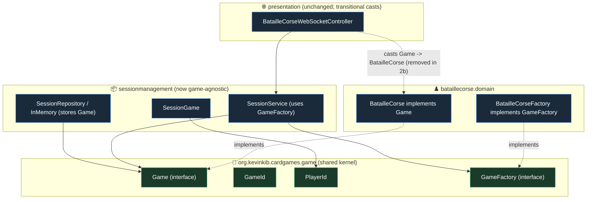

# Game Abstraction & Session-Core Generalization (Slice 2a) — Design

**Date:** 2026-06-14
**Status:** Approved (design); ready for planning
**Scope of this spec:** Slice 2a only — introduce a game-agnostic `Game` abstraction and make the Session bounded context depend on it instead of `BatailleCorse`. Backend only, no transport changes. The presentation split, Bullshit's transport, Bullshit's identity migration, and multi-game selection are **Slice 2b** (separate spec).

## Goal

Today the Session bounded context (`SessionService`, `SessionGame`, `SessionRepository`, `InMemorySessionRepository`) is hardwired to `BatailleCorse` / `BatailleCorseId` / BatailleCorse's `PlayerId`, and `SessionService` constructs `new BatailleCorse(...)` directly. Slice 2a breaks that coupling by introducing a shared kernel (`Game`, `GameId`, `PlayerId`, `GameFactory`) so the session layer can host *any* game. BatailleCorse continues to work and play exactly as before; no behaviour changes.

This is the foundation for Slice 2b (presentation split + wiring Bullshit over the wire).

## Context: how the session couples to BatailleCorse today

- `SessionRepository`/`InMemorySessionRepository` are typed to `BatailleCorse`, `BatailleCorseId`, `PlayerId`; `evictStale` calls `game.isFinished()`.
- `SessionService.createGame`/`rematch` call `new BatailleCorse(id, nbPlayers)` directly and return `BatailleCorse`.
- `SessionGame.create(BatailleCorseId, List<Player>)` reads `player.id()` for seats; keyed by `BatailleCorseId`.
- The disconnect path calls `BatailleCorse.concede(PlayerId)`.

What the session actually needs from a game is small: an id, `isFinished()`, the player ids, and forfeit. That is exactly the `Game` interface below.

## Decisions (from brainstorming)

- **Single shared `GameId` + `PlayerId`** (not per-game id types, not generics). The session is game-agnostic by design, so one concrete id type is correct; losing compile-time distinction between a BatailleCorse id and a Bullshit id is acceptable.
- **Migrate only BatailleCorse in 2a.** Bullshit is not in the session path yet, so churning its identity now is premature (YAGNI). The `Game` interface is validated against Bullshit on paper (it already exposes `id`/`isFinished`/`forfeit`/players); Bullshit's migration happens in 2b when it's actually wired.
- **Presentation kept working via transitional casts**, not redesigned. The presentation split is 2b.

## Architecture



### 1. Shared kernel — new package `org.kevinkib.cardgames.game`

- **`GameId`** — `record GameId(UUID uuid)` with a `String` constructor and `static GameId generate()`. Replaces `BatailleCorseId`.
- **`PlayerId`** — `record PlayerId(Integer id)` with `toString()` returning the id. Replaces `bataillecorse.domain.PlayerId`. (Bullshit's own `PlayerId` is untouched in 2a.)
- **`Game`** — the interface the session depends on, kept minimal:
  ```java
  public interface Game {
      GameId id();
      boolean isFinished();
      List<PlayerId> playerIds();
      void forfeit(PlayerId loser);
  }
  ```
  Deliberately excludes presentation concerns (winner, DTOs, available actions) — those stay per-game and are handled in 2b.
- **`GameFactory`** — `Game create(GameId id, int nbPlayers)`.

### 2. BatailleCorse conforms

- Replace `BatailleCorseId` usages with `GameId`; replace `bataillecorse.domain.PlayerId` with `game.PlayerId`.
- `BatailleCorse implements Game`:
  - `id()` — returns its `GameId` (was `getId()` → keep `getId()` too if presentation uses it, or migrate callers).
  - `isFinished()` — already present.
  - `playerIds()` — maps its `players` to their `PlayerId`s.
  - `forfeit(PlayerId loser)` — **rename of `concede(PlayerId)`**, same 2-player logic (sets the other player as winner, no-op when finished). Update callers (`DisconnectForfeitService`, `BatailleCorseConcedeTest`).
- New `BatailleCorseFactory implements GameFactory` → `new BatailleCorse(id, nbPlayers)`. Declared as a bean in `AppConfig`.

### 3. Generic session

- **`SessionService`** takes a `GameFactory` (constructor-injected; wired in `AppConfig` to `BatailleCorseFactory`). `createGame`/`rematch` call `factory.create(GameId, nbPlayers)`. Returns `Game`; all ids are `GameId`. Which factory to use when there are multiple games is a **2b** concern — 2a has exactly one, so behaviour is unchanged.
- **`SessionGame.create(GameId, List<PlayerId>)`** — takes player ids directly (caller passes `game.playerIds()`), rather than reading from domain `Player`s.
- **`SessionRepository` / `InMemorySessionRepository`** — store `Game` keyed by `GameId`; `save(Game, SessionGame)`, `load(GameId): Game`; `evictStale` uses `game.isFinished()`.
- **`DisconnectForfeitService`** — the forfeit path calls the generic `Game.forfeit(PlayerId)`.

### 4. Presentation (transitional, not redesigned)

The BatailleCorse controller and DTOs still need the concrete type. Where they pull a game from the session (now `Game`), they **cast to `BatailleCorse`**. These casts are explicit and temporary; 2b removes them by splitting presentation into shared + per-game adapters. No DTO/event/action changes in 2a.

## Testing

Per project testing rules (no Mockito on domain; builders/fixtures; `givenX_thenY`):

- **Game-agnosticism proof:** session tests run against a hand-written **`FakeGame`** (implements `Game`) and **`FakeGameFactory`** test double, demonstrating `SessionService`/`SessionGame`/repository work with no concrete game. This is the key new coverage.
- **Kernel:** `GameId` (round-trip, generate); BatailleCorse `Game`-conformance (`playerIds`, `forfeit` through the interface, `id`); `BatailleCorseFactory` creates a playable game.
- **Regression:** all 183 existing tests stay green, mechanically updated for the renamed id type (`GameId`) and `concede`→`forfeit`. BatailleCorse plays identically.

## Boundary

**Delivers:** the `org.kevinkib.cardgames.game` kernel; BatailleCorse conforming to it (+ factory); the session layer generalized over `Game`/`GameId`/`PlayerId`/`GameFactory`; transitional casts keeping presentation working; full test suite green plus the new `FakeGame`-driven session tests.

**Explicitly excludes (→ 2b and beyond):** presentation split into shared + per-game; Bullshit's migration to the kernel + `Game` impl + factory; the Bullshit WS adapter (actions/DTOs/events); multi-game selection (choosing which `GameFactory`); any frontend.
